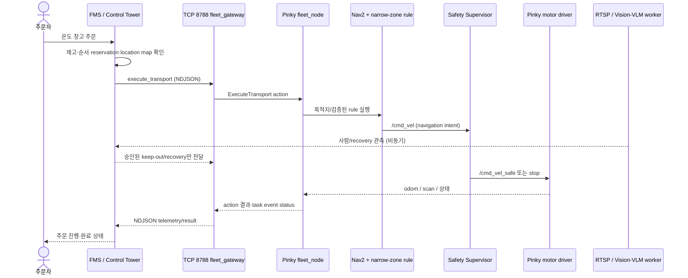

# Pinky 실기 자율주행·주문 실행 STEPS

## 목적과 실행 경계

이 가이드는 Pinky onboard bringup, 개발 PC의 Control Tower/감시, 온도 창고별 운반 시험을
한 흐름으로 정리한다. 명령 앞의 주체를 반드시 지킨다.

- `pinky@`: Pinky 실물에 SSH로 접속한 터미널
- `pc@`: FMS/Control Tower/모델 또는 ROS CLI를 실행하는 개발 PC 터미널

권한은 고정한다. FMS/Control Tower는 주문·작업 순서·전역 예약을 맡고, Pinky fleet은
명령을 `NavigateToPose`와 검증된 narrow-zone rule로 바꾼다. Nav2는 국소 경로를 만들며,
Safety Supervisor만 최종 `/cmd_vel_safe`를 발행한다. Vision/VLM/RL은 사람 관측 또는 승인된
recovery 후보를 낼 수 있지만 raw `/cmd_vel`이나 임의 좌표를 발행하지 않는다.

`vision_enabled:=true`는 Pinky 카메라를 RTSP로 내보내는 기능이다. 사람 검출 모델,
VLM/RL recovery runtime, Control Tower 승인 경로는 PC에서 별도로 살아 있어야 한다.
따라서 이 launch만으로 “모델까지 실행 완료”라고 판단하지 않는다.

## STEP 0. 공통 환경 자동 설정

각 새 터미널에서 자동으로 적용하려면 다음 블록을 **각 장비의 `~/.bashrc` 끝**에 넣는다.
경로와 IP는 먼저 실측한 값으로 바꾼다. 기존 `ROS_DOMAIN_ID`, Discovery Server, RMW 설정이
조직 표준으로 이미 있으면 같은 값을 중복·충돌 없이 사용한다.

```bash
# pinky@ ~/.bashrc
source /opt/ros/jazzy/setup.bash
source /home/pinky/pinky_pro/install/setup.bash
source /home/pinky/trihouse_ws/install/setup.bash
export ROS_DOMAIN_ID=<same-domain-id>
export ROS_AUTOMATIC_DISCOVERY_RANGE=SUBNET
export RMW_IMPLEMENTATION=rmw_fastrtps_cpp
export FASTDDS_BUILTIN_TRANSPORTS=UDPv4
```

```bash
# pc@ ~/.bashrc (PC ROS workspace를 build한 뒤의 실제 install 경로)
source /opt/ros/jazzy/setup.bash
source <trihouse-pc-workspace>/install/setup.bash
export ROS_DOMAIN_ID=<same-domain-id>
export ROS_AUTOMATIC_DISCOVERY_RANGE=SUBNET
export RMW_IMPLEMENTATION=rmw_fastrtps_cpp
export FASTDDS_BUILTIN_TRANSPORTS=UDPv4
```

적용 전 문법만 확인하고 새 shell을 열거나 현재 shell에 반영한다.

```bash
# pinky@ 또는 pc@
bash -n ~/.bashrc && source ~/.bashrc
printf 'domain=%s rmw=%s\n' "$ROS_DOMAIN_ID" "$RMW_IMPLEMENTATION"
```

Discovery Server를 사용하는 환경이라면 `ROS_AUTOMATIC_DISCOVERY_RANGE` 대신/함께 해당
운영 설정의 `ROS_DISCOVERY_SERVER=<pc-ip>:11811`를 **PC와 Pinky의 새 ROS process 모두**에
동일하게 설정한다. 실행 중인 node에는 환경 변경이 반영되지 않으므로 재기동한다.

## STEP 1. Pinky bringup

실물 주변을 비우고 E-stop 담당자를 배치한 뒤에만 시작한다. `<...>` 값은 확인한 지도,
revision, PC의 현재 LAN IP로 바꾼다.

```bash
# pinky@
source ~/.bashrc
export CONTROL_HOST='<control-pc-ip>'
export PINKY_MAP='<pinky-local-map-yaml>'
export MAP_REVISION='<published-map-revision>'
export NAV2_PARAMS="$(ros2 pkg prefix pinky_navigation)/share/pinky_navigation/params/nav2_params.yaml"

ros2 launch trihouse_pinky_bringup trihouse_pinky.launch.py \
  namespace:=/ \
  robot_id:=PK_01 \
  map:="$PINKY_MAP" \
  map_revision:="$MAP_REVISION" \
  nav2_params_file:="$NAV2_PARAMS" \
  control_host:="$CONTROL_HOST" \
  control_port:=8788 \
  narrow_zones_file:=<validated-narrow-zones-yaml> \
  narrow_map_name:=<map-name> \
  allow_narrow_calibration:=false \
  vision_enabled:=true \
  docking_enabled:=false
```

Pinky 터미널은 이 foreground launch를 유지한다. background 실행이 필요하면
`pinky-runtime-recovery.md`의 전용 process-group 절차만 사용한다.

## STEP 2. PC Control Tower·모델·감시 준비

`control_host:8788`은 **Pinky가 접속하는 Control Tower link server**다. PC에서 `nc`로
TCP 8788에 JSON을 쓰는 것은 주문 입력 방법이 아니며, Pinky gateway를 대신할 수 없다.
실운영 주문은 FMS/Control Tower가 `execute_transport`를 기존 연결에 내려보내야 한다.

PC에서는 우선 link와 status만 확인한다.

```bash
# pc@
source ~/.bashrc
export FMS_API='http://<fms-host>:8080'
nc -vz -w 3 <control-pc-ip> 8788
timeout 15 ros2 topic echo /trihouse/status trihouse_interfaces/msg/RobotStatus --once
timeout 15 ros2 topic echo /trihouse/safety/state trihouse_interfaces/msg/SafetyState --once
```

다음 값이 모두 맞을 때만 다음 단계로 간다: `frame_id: map`, 실행 지도와 같은
`map_revision`, `telemetry_valid/execution_ready/dispatchable/ready: true`, `errors: []`,
`safety.detail: clear`.

모델 경로도 별도로 확인한다. RTSP publish 성공은 모델 runtime 성공이 아니다. PC의 inference
runtime는 승인된 model/weight와 배포된 Control Tower downlink 계약으로 기동하고, 사람 관측이
`/trihouse/vision/person_detection/base`로 들어오는지 확인한다. VLM/RL은 stuck 상황에서
allowlist recovery 후보를 제안할 뿐, FMS 승인과 Safety Supervisor veto를 통과한 경우만 실행한다.

승인된 사람 검출 weight가 있는 PC에서는 아래처럼 FMS observation endpoint로 보낸다. 이
process는 사람 관측을 보내지만 ROS velocity command를 직접 발행하지 않는다.

```bash
# pc@ 별도 모델 터미널: <approved-person-weights>는 승인된 best.pt 또는 manifest
cd <trihouse-repository-root>
venv/yolo_segmentation/bin/python -m model.worker.person.worker \
  --weights <approved-person-weights> \
  --source 'rtsp://<pc1-lan-ip>:8554/pinky/CAM-PK-01' \
  --report-url "$FMS_API/internal/v1/vision/person-detections" \
  --headless
```

VLM/RL recovery runtime는 physical mode에서 `operator_approved` 실행 모드와 승인된 policy
checkpoint/hash, RTSP URL, FMS URL, device ID를 모두 요구한다. 이 값이 아직 확정되지
않았다면 실행하지 않는다.

```bash
# pc@ 승인된 값이 모두 배포된 경우에만 별도 모델 터미널에서 실행
export VLM_RL_EXECUTION_MODE=operator_approved
export FMS_GATEWAY_URL="$FMS_API"
export RECOVERY_DEVICE_ID='PK_01'
export VISION_RTSP_URL='rtsp://<pc1-lan-ip>:8554/pinky/CAM-PK-01'
export SEGMENTATION_WEIGHTS='<approved-segmentation-weights>'
export RECOVERY_POLICY_CHECKPOINT='<approved-recovery-policy>'
export RECOVERY_POLICY_SHA256='<approved-policy-sha256>'
python3 -m model.vlm_rl.inference.runtime --runtime-mode physical
```

```bash
# pc@ 모델/vision worker를 이미 운영 방식으로 기동한 뒤, input만 읽기 전용 확인
timeout 15 ros2 topic echo \
  /trihouse/vision/person_detection/base \
  trihouse_interfaces/msg/PersonDetection --once
```

사람이 없는 정상 상황에서는 위 topic이 timeout일 수 있다. 그 경우 모델이 종료됐다고
단정하지 말고 worker의 health/log와 RTSP 입력을 별도로 확인한다.

## STEP 3. 주문 전 go/no-go

```bash
# pinky@
timeout 12 ros2 topic echo /trihouse/readiness trihouse_interfaces/msg/Readiness --once
timeout 12 ros2 topic echo /trihouse/status trihouse_interfaces/msg/RobotStatus --once
ros2 topic info /cmd_vel_safe --verbose
```

`Readiness.state: 1`, `missing_interfaces: []`, `status.ready: true`, `errors: []` 및
`/cmd_vel_safe`의 유일한 publisher `safety_supervisor`를 확인한다. 하나라도 아니면
`pinky-runtime-recovery.md`의 0절부터 복구하고 주문을 보내지 않는다.

## STEP 4. 정식 FMS 주문 입력: 온도 창고별·다중 창고별

정식 주문은 TCP 8788 JSON이나 ROS action을 직접 호출하지 않고 FMS public order API로
만든다. FMS가 inventory lot의 `temperature_zone`에서 방문 구역과 job step을 결정한다. 따라서
주문자는 `FROZEN` 같은 destination code나 pose를 입력하지 않는다.

먼저 실제 inventory와 temperature zone을 읽는다. 아래 출력의 `product_code` 중 해당
temperature zone에 `available_qty > 0`인 값을 주문 명령에 넣는다.

```bash
# pc@
export FMS_API='http://<fms-host>:8080'
curl -fsS "$FMS_API/api/v1/inventory/lots" | python3 -m json.tool
```

다음은 각각 **한 번만** 실행하는 주문 입력 예시다. `Idempotency-Key`는 재시도에도 같은
주문이면 같은 값, 서로 다른 주문이면 새 값이어야 한다. `<...>`는 위 inventory 조회에서
확인한 실제 SKU로 바꾼다.

```bash
# pc@ 상온 단일 주문
curl -fsS -X POST "$FMS_API/api/v1/orders" \
  -H 'Content-Type: application/json' \
  -H 'Idempotency-Key: ambient-order-001' \
  -d '{"external_reference":"AMBIENT-001","priority":"normal","allow_partial_fulfillment":false,"items":[{"product_code":"<ambient-sku>","quantity":1}]}' \
  | python3 -m json.tool

# pc@ 냉장 단일 주문
curl -fsS -X POST "$FMS_API/api/v1/orders" \
  -H 'Content-Type: application/json' \
  -H 'Idempotency-Key: chilled-order-001' \
  -d '{"external_reference":"CHILLED-001","priority":"normal","allow_partial_fulfillment":false,"items":[{"product_code":"<chilled-sku>","quantity":1}]}' \
  | python3 -m json.tool

# pc@ 냉동 단일 주문
curl -fsS -X POST "$FMS_API/api/v1/orders" \
  -H 'Content-Type: application/json' \
  -H 'Idempotency-Key: frozen-order-001' \
  -d '{"external_reference":"FROZEN-001","priority":"normal","allow_partial_fulfillment":false,"items":[{"product_code":"<frozen-sku>","quantity":1}]}' \
  | python3 -m json.tool

# pc@ 다중 창고 주문: ambient·chilled·frozen SKU를 한 주문에 함께 넣는다.
curl -fsS -X POST "$FMS_API/api/v1/orders" \
  -H 'Content-Type: application/json' \
  -H 'Idempotency-Key: multi-zone-order-001' \
  -d '{"external_reference":"MULTI-ZONE-001","priority":"high","allow_partial_fulfillment":false,"items":[{"product_code":"<ambient-sku>","quantity":1},{"product_code":"<chilled-sku>","quantity":1},{"product_code":"<frozen-sku>","quantity":1}]}' \
  | python3 -m json.tool
```

성공 응답의 `job_id`를 기록한다. 단, `POST /api/v1/orders`는 주문과 job step을 저장할
뿐 로봇을 움직이지 않는다. PC의 job runner가 로봇·OMX·packing dock을 배정하고 dispatch하며,
executor worker가 OMX/FMS 단계를 완료 보고해야 다음 step이 열린다. 이미 서비스로 관리하지
않는 개발 환경에서는 아래 process를 별도 `pc@` 터미널에서 실행한다.

```bash
# pc@ 터미널 A: queued job을 배정·dispatch한다.
source ~/.bashrc
cd <trihouse-repository-root>
python3 -m control_tower.task_manager.job_runner_node \
  --fms-base-url "$FMS_API" --poll-interval-s 1
```

```bash
# pc@ 터미널 B: OMX/FMS 단계 실행 및 완료 보고.
# OMX 실장비 action endpoint가 검증된 경우에만 hardware를 사용한다.
source ~/.bashrc
cd <trihouse-repository-root>
python3 -m control_tower.task_manager.executor_worker_node \
  --fms-base-url "$FMS_API" --environment hardware --poll-interval-s 1
```

PC의 FMS/RMF gateway worker도 실행해야 dispatched mobile step이 Pinky의 `fleet_gateway`에
전달된다. RMF core/fleet adapter가 이미 기동·연결된 뒤 별도 PC 터미널에서 실행한다.

```bash
# pc@ 터미널 C: FMS mobile dispatch를 RMF task API로 전달하고 결과를 다시 FMS에 반영
source ~/.bashrc
cd <trihouse-repository-root>
python3 -m control_tower.rmf_adapter.rmf_gateway_worker_node \
  --fms-base-url "$FMS_API" --fleet-name <rmf-fleet-name> --poll-interval-s 1
```

이 worker나 OMX endpoint가 없다면 주문은 의도적으로 대기 상태에 남는다. 임의의
`/cmd_vel` 또는 직접 TCP command로 이 gate를 우회하지 않는다.

주문 생성 후 job status와 timeline을 확인한다.

```bash
# pc@ <job-id>는 POST 응답의 job_id
curl -fsS "$FMS_API/api/v1/jobs/<job-id>" | python3 -m json.tool
curl -fsS "$FMS_API/api/v1/jobs/<job-id>/timeline" | python3 -m json.tool
```

## STEP 5. gateway가 받는 transport command 형식

아래는 FMS가 만드는 **정식 `execute_transport` payload 형식**이다. `<location-id>`와
`<x,y,yaw>`는 반드시 현재 publish된 location map에서 조회한다. 이름만 보고 좌표를
추측하거나, 다른 revision의 좌표를 재사용하지 않는다.

| 케이스 | `destination_code` | `dropoff_location_id` | 실행 특성 |
| --- | --- | --- | --- |
| 냉동 단일 | `FROZEN` | 현재 지도에 등록된 냉동 loading/dock ID | 검증된 narrow-zone rule이 있어야 한다. |
| 냉장 단일 | `CHILLED` | 현재 지도에 등록된 냉장 loading/dock ID | 일반 Nav2 또는 검증된 zone profile을 쓴다. |
| 상온 단일 | `AMBIENT` | 현재 지도에 등록된 상온 loading/dock ID | 일반 Nav2 또는 검증된 zone profile을 쓴다. |
| 다중 창고 | 각 stop마다 위 세 형식 | 각 stop의 고유 ID | 한 transport action에 목적지를 섞지 말고 FMS가 순서·예약을 가진 여러 job step으로 분해한다. |

```json
{
  "type": "execute_transport",
  "message_id": "<unique-message-id>",
  "task_context": {
    "active": true,
    "job_id": 101,
    "job_step_id": 1,
    "assignment_revision": 1,
    "rmf_task_id": "<rmf-task-id-or-empty>",
    "command_id": "<unique-command-id>",
    "map_revision": "<published-map-revision>",
    "command_source": "fms"
  },
  "dropoff_location_id": "<frozen-or-chilled-or-ambient-location-id>",
  "destination_code": "FROZEN",
  "dropoff_pose": {"frame_id": "map", "x": <x>, "y": <y>, "yaw": <yaw-rad>},
  "mode": "TRANSPORT",
  "requires_precise_stop": false
}
```

단일 주문은 위 JSON에서 `destination_code`만 `FROZEN`/`CHILLED`/`AMBIENT`로 바꾸는 것이
아니라, 반드시 그 구역의 location ID·pose도 함께 바꾼다. 다중 창고 주문은 예를 들어
`FROZEN → CHILLED → AMBIENT`를 `job_step_id: 1 → 2 → 3`으로 만들고, 매 step마다 새
`message_id`/`command_id`를 쓴다. FMS가 이전 step의 도착·인계 결과를 확인한 뒤 다음
step을 dispatch한다. Pinky가 다음 창고 순서나 충돌 예약을 스스로 결정하지 않는다.

## STEP 6. 제한된 PC ROS CLI 주행 시험

FMS API/Control Tower 주문 UI가 아직 준비되지 않은 환경에서만, 현장 safety 담당자 입회
하에 PC ROS CLI로 action server를 직접 시험할 수 있다. 이는 TCP gateway·FMS reservation을
우회하는 **통합 전 검증용**이며 정식 주문 입력이 아니다. 실제 location map 값을 넣고,
한 구역·한 action만 보낸다.

```bash
# pc@ FROZEN 단일 구역 예시 — 실제 map 좌표와 revision으로 대체
ros2 action send_goal /trihouse/transport/execute \
  trihouse_interfaces/action/ExecuteTransport \
  "{task_context: {active: true, job_id: 101, job_step_id: 1, assignment_revision: 1, rmf_task_id: '', command_id: 'manual-frozen-001', map_revision: '<published-map-revision>', command_source: 'manual-supervised-test'}, pickup_location_id: '', dropoff_location_id: '<frozen-location-id>', destination_code: 'FROZEN', pickup_pose: {header: {frame_id: 'map'}, pose: {orientation: {w: 1.0}}}, dropoff_pose: {header: {frame_id: 'map'}, pose: {position: {x: <x>, y: <y>}, orientation: {z: <sin-yaw-half>, w: <cos-yaw-half>}}}, priority: 0, requires_precise_stop: false, handover_expected: false, mode: 0}" --feedback
```

냉장/상온 시험은 이 command의 `job_id`, `command_id`, `dropoff_location_id`,
`destination_code`, pose를 각각 새 값으로 바꾼다. 다중 창고에는 위 direct action을 연속
복사하지 않는다. 정식 FMS job-step workflow로만 실행한다.

## STEP 7. 운행 중 모니터링과 중단 기준

```bash
# pc@ status·task event 감시
ros2 topic echo /trihouse/status trihouse_interfaces/msg/RobotStatus
ros2 topic echo /trihouse/navigation/state trihouse_interfaces/msg/NavigationState
ros2 topic echo /trihouse/task/events trihouse_interfaces/msg/TaskEvent
```

SafetyState가 `SLOW`, `STOP`, `EMERGENCY`가 되거나 status의 `ready`가 false가 되면 다음
job step을 dispatch하지 않는다. emergency clear는 현장 확인 후 권한 있는 운영자가 수행하며,
model/vision 또는 일반 사용자가 clear하지 않는다.

## 통신 sequence diagram



diagram의 Vision 화살표는 관측/제안 경로다. motor control 경로가 아니며, Safety
Supervisor의 stop/veto 권한을 우회하지 않는다.
