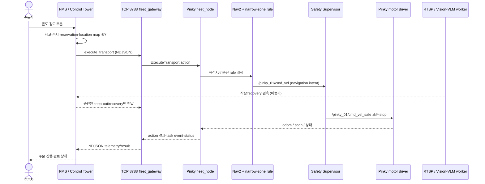

# Pinky 실기 자율주행·주문 실행 STEPS

> **2026-08-23 현재 상태 — 주행 금지.** Pinky_01에서
> `namespace:=pinky_01` bringup과 `/pinky_01/trihouse/status`,
> `/pinky_01/trihouse/safety/state` 수신까지 확인했다. 그러나 마지막 실측 status는
> `odom_stale`, `map_pose_stale`, `nav_unavailable`, `battery_not_dispatchable`였으며
> `ready: false`였다. 아래 go/no-go가 전부 PASS하기 전에는 주문이나 calibration goal을
> 보내지 않는다.

## 목적과 실행 경계

이 가이드는 Pinky onboard bringup, 개발 PC의 Control Tower/감시, 온도 창고별 운반 시험을
한 흐름으로 정리한다. 명령 앞의 장비와 터미널 번호를 반드시 지킨다.

- `[개발 PC 터미널 1]`: Fast DDS Discovery Server와 네트워크 확인
- `[Pinky_01 터미널 1 — bringup]`: 기존 프로세스 정리와 foreground bringup
- `[Pinky_01 터미널 2 — 확인]`: 노드, lifecycle, status, safety 확인
- `[개발 PC 터미널 2 — 감시/시험]`: status 감시와 승인된 단일 action 시험
- 정식 FMS 주문에는 뒤에서 설명하는 개발 PC worker 터미널이 추가로 필요하다.

ROS namespace와 관제 robot ID는 다르다. 현재 대응은 아래가 정본이다.

| 로봇 | ROS namespace | robot ID |
| --- | --- | --- |
| Pinky_01 | `pinky_01` | `PK_01` |
| Pinky_02 | `pinky_02` | `PK_02` |

Pinky_02에서 사용한 방식처럼 Pinky_01도 반드시 `namespace:=pinky_01`로 실행한다.
`namespace:=/`는 과거 단일 로봇 root fallback 기록이다. 현재
`bringup_robot_namespaced.launch.xml`과 함께 쓰면 `/scan.header.frame_id`가
`/rplidar_link`가 되어 tf2가 거부하는 결함을 실측했으므로 실행하지 않는다.

권한은 고정한다. FMS/Control Tower는 주문·작업 순서·전역 예약을 맡고, Pinky fleet은
명령을 `NavigateToPose`와 검증된 narrow-zone rule로 바꾼다. Nav2는 국소 경로를 만들며,
Safety Supervisor만 최종 `/pinky_01/cmd_vel_safe`를 발행한다. Vision/VLM/RL은 사람 관측
또는 승인된 recovery 후보를 낼 수 있지만 raw `/pinky_01/cmd_vel`이나 임의 좌표를 발행하지
않는다.

`vision_enabled:=true`는 Pinky 카메라를 RTSP로 내보내는 기능이다. 사람 검출 모델,
VLM/RL recovery runtime, Control Tower 승인 경로는 PC에서 별도로 살아 있어야 한다.
따라서 이 launch만으로 “모델까지 실행 완료”라고 판단하지 않는다.

## STEP 0. 공통 DDS 환경과 Discovery Server

오늘 시험에서는 개발 PC `192.168.0.4`, Pinky_01 `192.168.0.21`, ROS domain `12`,
Fast DDS Discovery Server `192.168.0.4:11811`을 사용했다. IP가 바뀌면 먼저 실측하여
모든 값을 함께 바꾼다. 이 절차를 검증하는 동안에는 `~/.bashrc`를 수정하지 않고 새 터미널마다
아래 값을 적용한다.

2026-08-23 실패 당시 Pinky launch에 다음 과거 profile이 남아 있었다.

```text
FASTRTPS_DEFAULT_PROFILES_FILE=/home/pinky/pinky_test/fastdds_pinky_to_113.xml
```

이 파일은 이전 망의 `192.168.129.113`을 initial peer로 사용한다. 현재 Discovery Server
설정과 섞지 않는다.

```bash
# [개발 PC 터미널 1 — Discovery Server]
cd /home/newuser/Trihouse/.worktrees/physical-integration-v1

source /opt/ros/jazzy/setup.bash
source install/setup.bash

export ROS_DOMAIN_ID=12
export ROS_AUTOMATIC_DISCOVERY_RANGE=SYSTEM_DEFAULT
export ROS_DISCOVERY_SERVER='192.168.0.4:11811'
export RMW_IMPLEMENTATION=rmw_fastrtps_cpp
export FASTDDS_BUILTIN_TRANSPORTS=UDPv4
unset ROS_STATIC_PEERS
unset FASTRTPS_DEFAULT_PROFILES_FILE
```

Discovery Server를 한 개만 실행한다.

```bash
# [개발 PC 터미널 1 — Discovery Server]
pgrep -af '[f]astdds discovery' || {
  setsid nohup fastdds discovery \
    -i 0 \
    -l 192.168.0.4 \
    -p 11811 \
    > /tmp/trihouse_discovery_server.log 2>&1 < /dev/null &
}

sleep 3
pgrep -af '[f]astdds discovery'
ss -lunp | grep ':11811'
```

두 Pinky 터미널 모두 source 이후에 stale profile을 해제한다.

```bash
# [Pinky_01 터미널 1 — bringup]
# [Pinky_01 터미널 2 — 확인]
source /opt/ros/jazzy/setup.bash
source /home/pinky/pinky_pro/install/setup.bash
source /home/pinky/trihouse_ws/install/setup.bash

export ROS_DOMAIN_ID=12
export ROS_AUTOMATIC_DISCOVERY_RANGE=SYSTEM_DEFAULT
export ROS_DISCOVERY_SERVER='192.168.0.4:11811'
export RMW_IMPLEMENTATION=rmw_fastrtps_cpp
export FASTDDS_BUILTIN_TRANSPORTS=UDPv4
unset ROS_STATIC_PEERS
unset FASTRTPS_DEFAULT_PROFILES_FILE

printf 'domain=<%s> discovery=<%s> profile=<%s>\n' \
  "$ROS_DOMAIN_ID" \
  "$ROS_DISCOVERY_SERVER" \
  "${FASTRTPS_DEFAULT_PROFILES_FILE-}"
```

정상 출력은 `domain=<12>`, `discovery=<192.168.0.4:11811>`, `profile=<>`다. 환경은
프로세스 시작 때 고정되므로 이미 실행 중인 ROS process에는 `unset`이 소급 적용되지 않는다.

## STEP 1. 기존 process 정리

실물 주변을 비우고 E-stop 담당자를 배치한다. 다음 종료 명령은 기존 Nav2와 모터 제어를
중단하며 되돌리려면 bringup을 다시 실행해야 한다.

먼저 종료 대상을 읽기 전용으로 확인한다.

```bash
# [Pinky_01 터미널 1 — bringup]
pgrep -af \
  '[r]os2 launch trihouse_pinky_bringup trihouse_pinky.launch.py' ||
  echo 'PASS: 통합 launch 없음'

pgrep -af \
  '[a]mcl|[m]ap_server|[l]ifecycle_manager|[c]ontroller_server|[p]lanner_server|[b]t_navigator|[s]llidar_node' ||
  echo 'PASS: Nav2와 LiDAR clean'
```

오늘 실패에서는 통합 launch 외에 `~/pinky_test/dwb_nav2_params_ns.yaml`을 쓰는 수동
`map_server`, `amcl`, localization manager와 `nav2_bringup navigation_launch.py` 두 세트가
동시에 남아 있었다. 통합 launch와 수동 Nav2를 함께 실행하지 않는다.

통합 launch와 수동 `ros2 run`/`nav2_bringup` 부모에 먼저 SIGINT를 보낸다.

```bash
# [Pinky_01 터미널 1 — bringup]
LAUNCH_PIDS="$(
  pgrep -f \
    '^/usr/bin/python3 /opt/ros/jazzy/bin/ros2 launch trihouse_pinky_bringup trihouse_pinky.launch.py' ||
  true
)"

MANUAL_NAV2_PIDS="$(
  pgrep -f \
    '^/usr/bin/python3 /opt/ros/jazzy/bin/ros2 (run nav2_|launch nav2_bringup )' ||
  true
)"

STOP_PIDS="$(printf '%s\n%s\n' "$LAUNCH_PIDS" "$MANUAL_NAV2_PIDS" | xargs)"
if [ -n "$STOP_PIDS" ]; then
  ps -fp $STOP_PIDS
  kill -INT $STOP_PIDS
  sleep 8
fi
```

다시 확인한다.

```bash
# [Pinky_01 터미널 1 — bringup]
pgrep -af \
  '[r]os2 launch trihouse_pinky_bringup trihouse_pinky.launch.py' ||
  echo 'PASS: 통합 launch clean'

pgrep -af \
  '[a]mcl|[m]ap_server|[l]ifecycle_manager|[c]ontroller_server|[p]lanner_server|[b]t_navigator|[s]llidar_node' ||
  echo 'PASS: Nav2와 LiDAR clean'
```

두 PASS가 모두 나와야 다음 단계로 간다. 프로세스가 남으면 새 launch를 겹쳐 띄우지 말고
`ps -fp <PID>`로 정확한 명령행을 확인한다.

## STEP 2. Pinky_01 namespaced bringup

현재 branch의 실기 경로는 `namespace:=pinky_01`과 namespace로 감싼 Nav2 params를 한 쌍으로
사용한다. 아래 launch는 foreground로 유지한다.

```bash
# [Pinky_01 터미널 1 — bringup]
export CONTROL_HOST='192.168.0.4'
export PINKY_MAP='/home/pinky/map/new_map_2.yaml'
export MAP_REVISION='new_map_2:df9a7f70eab87135a0e1a73c2b63a0a15aae2de3512a6c760a3259d0337a32ed'
export NAV2_PARAMS='/home/pinky/hardware_pinky_01.yaml'

env \
  -u FASTRTPS_DEFAULT_PROFILES_FILE \
  -u ROS_STATIC_PEERS \
  ros2 launch trihouse_pinky_bringup trihouse_pinky.launch.py \
  namespace:=pinky_01 \
  robot_id:=PK_01 \
  map:="$PINKY_MAP" \
  map_revision:="$MAP_REVISION" \
  nav2_params_file:="$NAV2_PARAMS" \
  control_host:="$CONTROL_HOST" \
  control_port:=8788 \
  narrow_zones_file:=/home/pinky/narrow_zones.new_map_2.yaml \
  narrow_map_name:=new_map_2 \
  allow_narrow_calibration:=true \
  vision_enabled:=false \
  docking_enabled:=false \
  2>&1 | tee /tmp/trihouse_pinky_pinky01.log
```

[Pinky_01 터미널 1]은 이 foreground launch를 유지한다. background 실행이 필요하면
`pinky-runtime-recovery.md`의 전용 process-group 절차만 사용한다.

별도 터미널에서 launch 인자와 stale profile 제거를 확인한다.

```bash
# [Pinky_01 터미널 2 — 확인]
PID="$(
  pgrep -f \
    '^/usr/bin/python3 /opt/ros/jazzy/bin/ros2 launch trihouse_pinky_bringup trihouse_pinky.launch.py' |
  head -1
)"

ps -fp "$PID"
tr '\0' '\n' < "/proc/$PID/environ" |
  grep -E 'ROS_DOMAIN_ID|ROS_DISCOVERY_SERVER|FASTRTPS_DEFAULT_PROFILES_FILE'
```

PASS 조건은 launch 명령행에 `namespace:=pinky_01`과
`nav2_params_file:=/home/pinky/hardware_pinky_01.yaml`이 있고, 환경 출력에
`ROS_DOMAIN_ID=12`, `ROS_DISCOVERY_SERVER=192.168.0.4:11811`만 있는 것이다.
`FASTRTPS_DEFAULT_PROFILES_FILE`이 출력되면 실패다.

launch 직후 STEP 3 명령을 실행하지 않는다. 현재 launch는 localization을 먼저 시작하고
navigation을 기본 60초 뒤에 시작한다. 2026-08-24 Pinky_01 실측에서는 launch 시작부터
localization과 navigation manager가 모두 active가 될 때까지 약 93초가 걸렸다. 고정된
`sleep`만 믿지 말고, 최대 120초 동안 두 완료 로그를 기다린다.

```bash
# [Pinky_01 터미널 2 — 최대 120초, 주행 명령 없음]
NAV2_WAIT_DEADLINE=$((SECONDS + 120))

while (( SECONDS < NAV2_WAIT_DEADLINE )); do
  if grep -aq \
      'lifecycle_manager_localization.*Managed nodes are active' \
      /tmp/trihouse_pinky_pinky01.log && \
     grep -aq \
      'lifecycle_manager_navigation.*Managed nodes are active' \
      /tmp/trihouse_pinky_pinky01.log
  then
    echo 'PASS: localization/navigation managers are active'
    break
  fi
  sleep 2
done

if ! grep -aq \
    'lifecycle_manager_localization.*Managed nodes are active' \
    /tmp/trihouse_pinky_pinky01.log || \
   ! grep -aq \
    'lifecycle_manager_navigation.*Managed nodes are active' \
    /tmp/trihouse_pinky_pinky01.log
then
  echo 'FAIL: Nav2 did not become active within 120 seconds'
  grep -aE \
    'lifecycle_manager_(localization|navigation)|Failed to bring up|Failed to change state|unable to be reached|process has died|Traceback' \
    /tmp/trihouse_pinky_pinky01.log | tail -120
  echo 'STEP 3 및 주문/주행을 진행하지 않는다.'
fi
```

두 manager 완료 로그가 먼저 나오면 120초를 모두 채우지 않고 STEP 3으로 넘어가도 된다.
120초 안에 나오지 않으면 기다림을 반복하거나 launch를 겹쳐 띄우지 말고 출력된 실패 로그를
`pinky-runtime-recovery.md` 16~17절 기준으로 진단한다.

## STEP 3. 노드와 lifecycle 확인

`ros2 node list`가 namespaced 노드를 보여도 lifecycle이 active라는 뜻은 아니다. Discovery
Server 환경에서는 짧은 CLI가 `Node not found`를 낼 수 있으므로 process, manager log,
lifecycle service를 함께 확인한다.

```bash
# [Pinky_01 터미널 2 — 확인]
ros2 node list | sort | grep '^/pinky_01/'

for node in amcl map_server controller_server planner_server bt_navigator; do
  echo "=== $node ==="
  timeout 30 ros2 lifecycle get "/pinky_01/$node"
done

grep -aE \
  'Managed nodes are active|Failed to bring up|Failed to change state|unable to be reached' \
  /tmp/trihouse_pinky_pinky01.log
```

Discovery Server 환경에서는 manager가 모든 lifecycle service와 bond에 연결한 뒤에도 짧은
`ros2 lifecycle get`이 `Node not found`를 출력할 수 있다. 2026-08-24 실측에서도 이 CLI
오탐이 발생했으므로 daemon을 STEP 3 직전에 재시작해서 3초 뒤 결과만 판정 근거로 삼지
않는다. lifecycle CLI는 보조 증거이며, 최종 PASS는 다음 두 조건을 함께 사용한다.

1. localization과 navigation manager가 각각 `Managed nodes are active`를 기록한다.
2. onboard readiness가 `state: 1`, `missing_interfaces: []`를 발행한다.

```bash
timeout 30 ros2 topic echo \
  /pinky_01/trihouse/readiness \
  trihouse_interfaces/msg/Readiness \
  --once
```

다섯 lifecycle 노드가 `active [3]`이면 추가 증거가 된다. `Node not found`가 나오더라도 위
두 PASS 조건이 맞으면 정상 launch를 재시작하지 않는다. manager 완료 로그나 readiness가
실패하면 실제 process와 서비스를 추가로 확인한다.

```bash
# [Pinky_01 터미널 2 — 확인]
pgrep -af \
  'nav2_amcl/amcl|nav2_map_server/map_server|nav2_controller/controller_server|nav2_planner/planner_server|nav2_bt_navigator/bt_navigator'

timeout 30 ros2 service list --no-daemon |
  grep -E '^/pinky_01/(amcl|map_server|controller_server|planner_server|bt_navigator)/(get_state|change_state)'
```

오늘 실측한 실패 연쇄는 다음과 같다.

```text
과거 FASTRTPS profile 또는 중복 수동 Nav2
→ lifecycle service/bond 발견 지연
→ map_server bond 실패
→ AMCL 활성화 중단
→ map → odom TF 없음
→ planner_server activation timeout
→ nav_unavailable + map_pose_stale + odom_stale
```

### 오늘 실측한 상온·냉장 좌표 상태

개발 PC의 `config/narrow_zones.new_map_2.yaml`과 Pinky_01의
`/home/pinky/narrow_zones.new_map_2.yaml`은 SHA256
`006e99ce81ce640ccd89069fec16c9144f4ed252cb5d2760ede74173b8eac74f`로 동일함을
확인했다.

| 목적지 | 실측 entry | dock 상태 |
| --- | --- | --- |
| 상온 | `x=0.911748152598201`, `y=0.77587646431032`, `yaw=0.875201645910827` | `dock_target=(1.194985191182392, 0.874754065282721)`, 계산 후보, `dock_pose: false` |
| 냉장 | `x=0.7859059395041531`, `y=0.875244991226244`, `yaw=0.8744648231294354` | 기존 계산 후보, enter/exit와 dock 모두 미검증 |

상온의 과거 목표 `x=1.293481094178777`, `y=1.0156120986977553`으로 보낸 calibration
goal은 `code: 3`, `navigation failed`로 ABORT됐다. 당시 root namespace의
`/rplidar_link` 결함과 `front_stop`이 함께 관측됐으므로 이 실패 목표를 성공 좌표로
재사용하지 않는다. 좌표 calibration 상세는 `pinky-ambient-chilled-calibration.md`를 따른다.

## STEP 4. PC Control Tower·감시 준비

`control_host:8788`은 **Pinky가 접속하는 Control Tower link server**다. PC에서 `nc`로
TCP 8788에 JSON을 쓰는 것은 주문 입력 방법이 아니며, Pinky gateway를 대신할 수 없다.
실운영 주문은 FMS/Control Tower가 `execute_transport`를 기존 연결에 내려보내야 한다.

PC에서는 우선 link와 status만 확인한다.

```bash
# [개발 PC 터미널 2 — 감시/시험]
cd /home/newuser/Trihouse/.worktrees/physical-integration-v1
source /opt/ros/jazzy/setup.bash
source install/setup.bash

export ROS_DOMAIN_ID=12
export ROS_AUTOMATIC_DISCOVERY_RANGE=SYSTEM_DEFAULT
export ROS_DISCOVERY_SERVER='192.168.0.4:11811'
export RMW_IMPLEMENTATION=rmw_fastrtps_cpp
export FASTDDS_BUILTIN_TRANSPORTS=UDPv4
unset ROS_STATIC_PEERS
unset FASTRTPS_DEFAULT_PROFILES_FILE

export FMS_API='http://<fms-host>:8080'
nc -vz -w 3 192.168.0.4 8788
timeout 30 ros2 topic echo \
  /pinky_01/trihouse/status \
  trihouse_interfaces/msg/RobotStatus \
  --once
timeout 30 ros2 topic echo \
  /pinky_01/trihouse/safety/state \
  trihouse_interfaces/msg/SafetyState \
  --once
```

다음 값이 모두 맞을 때만 다음 단계로 간다: `frame_id: map`, 실행 지도와 같은
`map_revision`, `telemetry_valid/execution_ready/dispatchable/ready: true`, `errors: []`,
`safety.detail: clear`.

모델 경로도 별도로 확인한다. RTSP publish 성공은 모델 runtime 성공이 아니다. PC의 inference
runtime는 승인된 model/weight와 배포된 Control Tower downlink 계약으로 기동하고, 사람 관측이
`/pinky_01/trihouse/vision/person_detection/base`로 들어오는지 확인한다. VLM/RL은 stuck 상황에서
allowlist recovery 후보를 제안할 뿐, FMS 승인과 Safety Supervisor veto를 통과한 경우만 실행한다.

승인된 사람 검출 weight가 있는 PC에서는 아래처럼 FMS observation endpoint로 보낸다. 이
process는 사람 관측을 보내지만 ROS velocity command를 직접 발행하지 않는다.

각 모델 터미널에는 STEP 0의 개발 PC 환경을 적용하고 `FMS_API`를 다시 설정한다. 별도
터미널은 다른 터미널의 shell 변수를 상속하지 않는다.

```bash
# [개발 PC 모델 터미널 1] <approved-person-weights>는 승인된 best.pt 또는 manifest
cd /home/newuser/Trihouse/.worktrees/physical-integration-v1
export FMS_API='http://<fms-host>:8080'
venv/yolo_segmentation/bin/python -m model.worker.person.worker \
  --weights <approved-person-weights> \
  --source 'rtsp://<pc1-lan-ip>:8554/pinky/CAM-PK-01' \
  --report-url "$FMS_API/internal/v1/vision/person-detections" \
  --headless
```

VLM/RL recovery runtime는 physical mode에서 `operator_approved` 실행 모드와 승인된 policy
checkpoint/hash, RTSP URL, FMS URL, device ID를 모두 요구한다. 이 값이 아직 확정되지
않았다면 실행하지 않는다.

```bash
# [개발 PC 모델 터미널 2] 승인된 값이 모두 배포된 경우에만 실행
cd /home/newuser/Trihouse/.worktrees/physical-integration-v1
export FMS_API='http://<fms-host>:8080'
export VLM_RL_EXECUTION_MODE=operator_approved
export FMS_GATEWAY_URL="$FMS_API"
export RECOVERY_DEVICE_ID='PK_01'
export VISION_RTSP_URL='rtsp://<pc1-lan-ip>:8554/pinky/CAM-PK-01'
export SEGMENTATION_WEIGHTS='<approved-segmentation-weights>'
export RECOVERY_POLICY_CHECKPOINT='<approved-recovery-policy>'
export RECOVERY_POLICY_SHA256='<approved-policy-sha256>'
python3 -m model.vlm_rl.inference.runtime --runtime-mode physical
```

```bash
# [개발 PC 터미널 2 — 감시/시험] 모델 worker 기동 후 input만 읽기 전용 확인
timeout 15 ros2 topic echo \
  /pinky_01/trihouse/vision/person_detection/base \
  trihouse_interfaces/msg/PersonDetection --once
```

사람이 없는 정상 상황에서는 위 topic이 timeout일 수 있다. 그 경우 모델이 종료됐다고
단정하지 말고 worker의 health/log와 RTSP 입력을 별도로 확인한다.

## STEP 5. 주문 전 go/no-go

```bash
# [Pinky_01 터미널 2 — 확인]
timeout 30 ros2 topic echo \
  /pinky_01/trihouse/readiness \
  trihouse_interfaces/msg/Readiness \
  --once

timeout 30 ros2 topic echo \
  /pinky_01/trihouse/status \
  trihouse_interfaces/msg/RobotStatus \
  --once

timeout 30 ros2 topic echo \
  /pinky_01/trihouse/safety/state \
  trihouse_interfaces/msg/SafetyState \
  --once

ros2 topic info /pinky_01/cmd_vel_safe --verbose
```

`Readiness.state: 1`, `missing_interfaces: []`, `status.ready: true`, `errors: []` 및
`/pinky_01/cmd_vel_safe`의 유일한 publisher `safety_supervisor`를 확인한다. 또한
`status.frame_id: map`, pose가 최신 실측값, `battery_policy.ready: true`,
`safety.detail: clear`여야 한다. 하나라도 아니면
`pinky-runtime-recovery.md`의 0절부터 복구하고 주문을 보내지 않는다.

`battery_percentage`에 숫자가 보이더라도 `battery_policy.measurement_valid: false`,
`has_valid_sample: false`, `telemetry_fresh: false`면 배터리 gate는 실패다. 마찬가지로
`safety.detail: clear` 하나만으로 전체 주행 준비가 증명되지는 않는다.

## STEP 6. 정식 FMS 주문 입력: 온도 창고별·다중 창고별

정식 주문은 TCP 8788 JSON이나 ROS action을 직접 호출하지 않고 FMS public order API로
만든다. FMS가 inventory lot의 `temperature_zone`에서 방문 구역과 job step을 결정한다. 따라서
주문자는 `FROZEN` 같은 destination code나 pose를 입력하지 않는다.

먼저 실제 inventory와 temperature zone을 읽는다. 아래 출력의 `product_code` 중 해당
temperature zone에 `available_qty > 0`인 값을 주문 명령에 넣는다.

```bash
# [개발 PC 주문 터미널]
export FMS_API='http://<fms-host>:8080'
curl -fsS "$FMS_API/api/v1/inventory/lots" | python3 -m json.tool
```

다음은 각각 **한 번만** 실행하는 주문 입력 예시다. `Idempotency-Key`는 재시도에도 같은
주문이면 같은 값, 서로 다른 주문이면 새 값이어야 한다. `<...>`는 위 inventory 조회에서
확인한 실제 SKU로 바꾼다.

```bash
# [개발 PC 주문 터미널] 상온 단일 주문
curl -fsS -X POST "$FMS_API/api/v1/orders" \
  -H 'Content-Type: application/json' \
  -H 'Idempotency-Key: ambient-order-001' \
  -d '{"external_reference":"AMBIENT-001","priority":"normal","allow_partial_fulfillment":false,"items":[{"product_code":"<ambient-sku>","quantity":1}]}' \
  | python3 -m json.tool

# [개발 PC 주문 터미널] 냉장 단일 주문
curl -fsS -X POST "$FMS_API/api/v1/orders" \
  -H 'Content-Type: application/json' \
  -H 'Idempotency-Key: chilled-order-001' \
  -d '{"external_reference":"CHILLED-001","priority":"normal","allow_partial_fulfillment":false,"items":[{"product_code":"<chilled-sku>","quantity":1}]}' \
  | python3 -m json.tool

# [개발 PC 주문 터미널] 냉동 단일 주문
curl -fsS -X POST "$FMS_API/api/v1/orders" \
  -H 'Content-Type: application/json' \
  -H 'Idempotency-Key: frozen-order-001' \
  -d '{"external_reference":"FROZEN-001","priority":"normal","allow_partial_fulfillment":false,"items":[{"product_code":"<frozen-sku>","quantity":1}]}' \
  | python3 -m json.tool

# [개발 PC 주문 터미널] 다중 창고 주문
curl -fsS -X POST "$FMS_API/api/v1/orders" \
  -H 'Content-Type: application/json' \
  -H 'Idempotency-Key: multi-zone-order-001' \
  -d '{"external_reference":"MULTI-ZONE-001","priority":"high","allow_partial_fulfillment":false,"items":[{"product_code":"<ambient-sku>","quantity":1},{"product_code":"<chilled-sku>","quantity":1},{"product_code":"<frozen-sku>","quantity":1}]}' \
  | python3 -m json.tool
```

성공 응답의 `job_id`를 기록한다. 단, `POST /api/v1/orders`는 주문과 job step을 저장할
뿐 로봇을 움직이지 않는다. PC의 job runner가 로봇·OMX·packing dock을 배정하고 dispatch하며,
executor worker가 OMX/FMS 단계를 완료 보고해야 다음 step이 열린다. 이미 서비스로 관리하지
않는 개발 환경에서는 아래 process를 각각 표시된 개발 PC 터미널에서 실행한다.

각 worker 터미널에는 STEP 0의 개발 PC DDS 환경을 동일하게 적용하고 다음 공통 설정을
먼저 실행한다.

```bash
# [개발 PC worker 터미널 A/B/C — 공통]
cd /home/newuser/Trihouse/.worktrees/physical-integration-v1
source /opt/ros/jazzy/setup.bash
source install/setup.bash
export FMS_API='http://<fms-host>:8080'
```

```bash
# [개발 PC worker 터미널 A] queued job을 배정·dispatch한다.
python3 -m control_tower.task_manager.job_runner_node \
  --fms-base-url "$FMS_API" --poll-interval-s 1
```

```bash
# [개발 PC worker 터미널 B] OMX/FMS 단계 실행 및 완료 보고.
# OMX 실장비 action endpoint가 검증된 경우에만 hardware를 사용한다.
python3 -m control_tower.task_manager.executor_worker_node \
  --fms-base-url "$FMS_API" --environment hardware --poll-interval-s 1
```

PC의 FMS/RMF gateway worker도 실행해야 dispatched mobile step이 Pinky의 `fleet_gateway`에
전달된다. RMF core/fleet adapter가 이미 기동·연결된 뒤 별도 PC 터미널에서 실행한다.

```bash
# [개발 PC worker 터미널 C] FMS mobile dispatch를 RMF task API로 전달하고 결과를 다시 FMS에 반영
python3 -m control_tower.rmf_adapter.rmf_gateway_worker_node \
  --fms-base-url "$FMS_API" --fleet-name <rmf-fleet-name> --poll-interval-s 1
```

이 worker나 OMX endpoint가 없다면 주문은 의도적으로 대기 상태에 남는다. 임의의
`/pinky_01/cmd_vel` 또는 직접 TCP command로 이 gate를 우회하지 않는다.

주문 생성 후 job status와 timeline을 확인한다.

```bash
# [개발 PC 주문 터미널] <job-id>는 POST 응답의 job_id
curl -fsS "$FMS_API/api/v1/jobs/<job-id>" | python3 -m json.tool
curl -fsS "$FMS_API/api/v1/jobs/<job-id>/timeline" | python3 -m json.tool
```

## STEP 7. gateway가 받는 transport command 형식

아래는 FMS가 만드는 **정식 `execute_transport` payload 형식**이다. `<location-id>`와
`<x,y,yaw>`는 반드시 현재 publish된 location map에서 조회한다. 이름만 보고 좌표를
추측하거나, 다른 revision의 좌표를 재사용하지 않는다.

| 케이스 | `destination_code` | `dropoff_location_id` | 실행 특성 |
| --- | --- | --- | --- |
| 냉동 단일 | `FROZEN` | 현재 지도에 등록된 냉동 loading/dock ID | 검증된 narrow-zone rule이 있어야 한다. |
| 냉장 단일 | `CHILLED` | 현재 지도에 등록된 냉장 loading/dock ID | 일반 Nav2 또는 검증된 zone profile을 쓴다. |
| 상온 단일 | `AMBIENT` | 현재 지도에 등록된 상온 loading/dock ID | 일반 Nav2 또는 검증된 zone profile을 쓴다. |
| 다중 창고 | 각 stop마다 위 세 형식 | 각 stop의 고유 ID | 한 transport action에 목적지를 섞지 말고 FMS가 순서·예약을 가진 여러 job step으로 분해한다. |

```json
{
  "type": "execute_transport",
  "message_id": "<unique-message-id>",
  "task_context": {
    "active": true,
    "job_id": 101,
    "job_step_id": 1,
    "assignment_revision": 1,
    "rmf_task_id": "<rmf-task-id-or-empty>",
    "command_id": "<unique-command-id>",
    "map_revision": "<published-map-revision>",
    "command_source": "fms"
  },
  "dropoff_location_id": "<frozen-or-chilled-or-ambient-location-id>",
  "destination_code": "FROZEN",
  "dropoff_pose": {"frame_id": "map", "x": <x>, "y": <y>, "yaw": <yaw-rad>},
  "mode": "TRANSPORT",
  "requires_precise_stop": false
}
```

단일 주문은 위 JSON에서 `destination_code`만 `FROZEN`/`CHILLED`/`AMBIENT`로 바꾸는 것이
아니라, 반드시 그 구역의 location ID·pose도 함께 바꾼다. 다중 창고 주문은 예를 들어
`FROZEN → CHILLED → AMBIENT`를 `job_step_id: 1 → 2 → 3`으로 만들고, 매 step마다 새
`message_id`/`command_id`를 쓴다. FMS가 이전 step의 도착·인계 결과를 확인한 뒤 다음
step을 dispatch한다. Pinky가 다음 창고 순서나 충돌 예약을 스스로 결정하지 않는다.

## STEP 8. 제한된 PC ROS CLI 주행 시험

FMS API/Control Tower 주문 UI가 아직 준비되지 않은 환경에서만, 현장 safety 담당자 입회
하에 PC ROS CLI로 action server를 직접 시험할 수 있다. 이는 TCP gateway·FMS reservation을
우회하는 **통합 전 검증용**이며 정식 주문 입력이 아니다. 실제 location map 값을 넣고,
한 구역·한 action만 보낸다.

```bash
# [개발 PC 터미널 2 — 감시/시험] FROZEN 단일 구역 예시
ros2 action send_goal /pinky_01/trihouse/transport/execute \
  trihouse_interfaces/action/ExecuteTransport \
  "{task_context: {active: true, job_id: 101, job_step_id: 1, assignment_revision: 1, rmf_task_id: '', command_id: 'manual-frozen-001', map_revision: '<published-map-revision>', command_source: 'manual-supervised-test'}, pickup_location_id: '', dropoff_location_id: '<frozen-location-id>', destination_code: 'FROZEN', pickup_pose: {header: {frame_id: 'map'}, pose: {orientation: {w: 1.0}}}, dropoff_pose: {header: {frame_id: 'map'}, pose: {position: {x: <x>, y: <y>}, orientation: {z: <sin-yaw-half>, w: <cos-yaw-half>}}}, priority: 0, requires_precise_stop: false, handover_expected: false, mode: 0}" --feedback
```

냉장/상온 시험은 이 command의 `job_id`, `command_id`, `dropoff_location_id`,
`destination_code`, pose를 각각 새 값으로 바꾼다. 다중 창고에는 위 direct action을 연속
복사하지 않는다. 정식 FMS job-step workflow로만 실행한다.

## STEP 9. 운행 중 모니터링과 중단 기준

```bash
# [개발 PC 터미널 2 — 감시/시험]
ros2 topic echo /pinky_01/trihouse/status trihouse_interfaces/msg/RobotStatus
ros2 topic echo /pinky_01/trihouse/navigation/state trihouse_interfaces/msg/NavigationState
ros2 topic echo /pinky_01/trihouse/task/events trihouse_interfaces/msg/TaskEvent
```

SafetyState가 `SLOW`, `STOP`, `EMERGENCY`가 되거나 status의 `ready`가 false가 되면 다음
job step을 dispatch하지 않는다. emergency clear는 현장 확인 후 권한 있는 운영자가 수행하며,
model/vision 또는 일반 사용자가 clear하지 않는다.

## 통신 sequence diagram



diagram의 Vision 화살표는 관측/제안 경로다. motor control 경로가 아니며, Safety
Supervisor의 stop/veto 권한을 우회하지 않는다.
