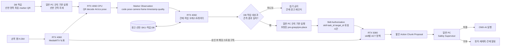
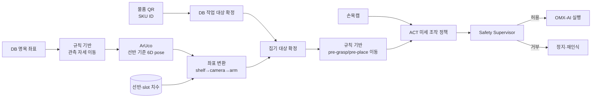
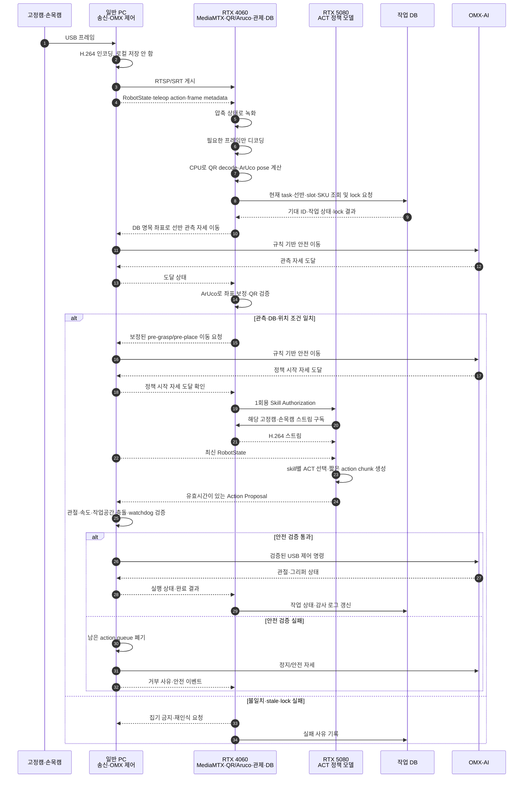

# Trihouse 로봇팔 모방학습·안전 작업 수행 설계 3차 초안

> 상태: 하이브리드 제어 구조 확정, DB 스키마·OMX-AI 제어 인터페이스·카메라 보정 검증 전 초안
>
> 작성일: 2026-08-05
>
> 목적: 고정캠과 손목캠으로 QR·Aruco·물건을 인식하고 DB 작업 정보와 검증한 뒤, RTX 5080의 모방학습 정책으로 OMX-AI가 안전하게 물건을 집어 적재하도록 한다.

영상 전송과 저장 구조는 [Trihouse 영상 전송·추론 서버 연결 아키텍처](./2026-08-05-vision-streaming-architecture-draft.md)를 따른다.

## 1. 핵심 설계 결정

- RTX 4060은 관제 시스템, 작업 오케스트레이션, DB 조회·검증, 감사 로그와 CPU 기반 QR/Aruco 인식을 담당한다.
- RTX 5080은 초기 구현에서 `pick`, `place_shelf`, `place_basket` ACT 학습·추론을 담당한다.
- 일반 PC 1·2는 각 OMX-AI의 USB 제어, 저수준 제어, safety supervisor, watchdog를 담당한다.
- DB 명목 좌표와 ArUco 보정 좌표로 수행할 수 있는 장거리·안전 이동은 규칙 기반 제어가 담당한다.
- ACT는 `pick`, `place_shelf`, `place_basket`의 미세 조작 구간에만 사용한다.
- 전체 작업은 서버에 기록하되 ACT 학습 에피소드는 정책 구간별로 분할한다.
- QR 인식 결과가 DB와 일치했다는 이유만으로 즉시 집기 명령을 실행하지 않는다.
- DB 일치, 관측 최신성, 반복 인식 안정성, 로봇 상태, 작업공간·관절·충돌 조건을 모두 통과해야 한다.
- 선반 안 물건의 위치 계산에는 RealSense Depth를 사용하지 않는 것으로 설계한다.
- 초기 로봇팔 구현에는 YOLO와 VLM을 사용하지 않는다. QR로 물품 ID를 검증하고 ACT가 영상에서 미세 접근·파지를 학습한다.

## 2. 최적 역할 배치

| 장치 | 역할 |
|---|---|
| RTX 4060 | 관제 UI, FMS/작업 서비스, QR decode, ArUco pose, DB 조회·매칭, skill authorization, 상태·이벤트 저장, 원격 영상 녹화, LeRobot 데이터셋 생성 |
| RTX 5080 | `pick`·`place_shelf`·`place_basket` ACT 학습·추론과 짧은 Action Proposal 생성 |
| 일반 PC 1 | 고정캠 1·손목캠 1 송신, OMX-AI 1 USB 제어, 안전 제한·watchdog |
| 일반 PC 2 | 고정캠 2·손목캠 2 송신, OMX-AI 2 USB 제어, 안전 제한·watchdog |
| OMX-AI 1·2 | 검증된 저수준 명령 실행, 관절·그리퍼 상태 반환 |
| RealSense/RTX 5080 | 통로·작업대 외부 영역의 공간 확인과 보조 안전 인지; 선반 내부 물품 Depth 추정에는 사용하지 않음 |

관제, QR/Aruco, DB 검증을 4060에 함께 두는 이유는 이 기능들이 하나의 결정론적 승인 경로를 구성하기 때문이다. 모델 서버가 재시작되거나 모델이 교체되어도 위치·ID 확인, 작업 상태, 승인 기록과 사용자 화면이 유지된다. 5080은 상태를 소유하지 않는 GPU 추론 worker로 취급한다.

안전은 두 계층으로 나눈다. RTX 4060은 작업 승인, DB lock, 도킹·marker·QR 상태와 같은 상위 안전 조건을 관리한다. 일반 PC는 OMX-AI와 USB로 직접 연결된 최종 실행 계층으로서 매 action의 관절·속도·작업공간 제한과 heartbeat를 검사한다. RTX 4060도 정지 요청을 보낼 수 있지만 네트워크 장애 시 원격 서버에 의존하지 않고 즉시 멈춰야 하므로 저수준 안전 실행의 유일한 담당자가 될 수 없다.

QR과 ArUco는 GPU가 필요한 딥러닝 모델이 아니다. 4060은 손목캠 전체를 항상 비압축 처리하지 않고, MediaMTX 스트림에서 필요한 프레임만 예를 들어 5~10 fps로 디코딩해 CPU로 검사한다. 따라서 녹화 부하를 크게 늘리지 않으면서 DB 검증과 가까운 곳에서 처리할 수 있다.

## 3. QR·DB 매칭과 skill 승인 구조

### 3.1 권장 데이터 흐름



### 3.2 QR observation에 필요한 필드

- `camera_id`
- `frame_id`
- `capture_timestamp`
- `qr_text` 또는 정규화한 `qr_id`
- decode confidence 또는 품질 점수
- 이미지 안 QR corner 좌표
- 사용한 decoder 버전
- 같은 값이 연속 검출된 횟수

### 3.3 DB에서 확인할 값

- 현재 `task_id`와 작업 상태
- 기대하는 창고 구역 ID
- 기대하는 선반 ID와 slot ID
- 기대하는 SKU·물품 ID
- 해당 물품의 pick 허용 여부
- 이미 처리된 작업인지 여부
- 작업 lock 소유자와 만료 시각

### 3.4 일치 판정 조건

다음 조건을 모두 통과할 때만 해당 `Skill Authorization`을 발급한다.

1. 관측 QR이 현재 작업의 기대 ID와 정확히 일치한다.
2. 관측이 정해진 시간 이내의 최신 프레임이다.
3. 동일 QR이 여러 프레임에서 안정적으로 반복 검출된다.
4. ArUco로 확인한 선반·작업대 좌표가 기대 위치와 일치한다.
5. 다른 로봇 또는 작업자가 같은 slot을 점유하지 않는다.
6. 작업 lock을 원자적으로 획득한다.
7. 로봇·카메라·네트워크 상태가 `HEALTHY`다.

QR 문자열을 SQL에 직접 연결하지 않는다. 정규화·허용 목록 검증 후 parameterized query 또는 서비스 API로 조회한다. 동일 `task_id`의 중복 실행을 막도록 authorization은 1회용이며 짧은 유효시간을 갖는다.

## 4. 위치·선반·물건 인식

### 4.1 필요한 알고리즘·모델

| 기능 | 알고리즘·모델 | 실행 위치 |
|---|---|---|
| QR 인식 | OpenCV QRCodeDetector 등의 QR decoder | RTX 4060 CPU worker |
| 선반·작업대 ID | QR/DB lookup | RTX 4060 |
| 선반 기준 좌표 | OpenCV ArUco/ChArUco + 카메라 보정 + PnP | RTX 4060 CPU worker |
| 학습 기반 접근·파지 action 생성 | ACT + 고정캠·손목캠·로봇 상태 | RTX 5080 GPU |
| 안전 검증·저수준 action 실행 | 결정론적 workspace·속도·관절·충돌·watchdog 검사 + OMX USB driver | 일반 PC |

QR decoder와 ArUco는 딥러닝 모델이 아니므로 RTX 5080이 필요하지 않다. OpenCV는 QR 검출·해독용 `QRCodeDetector`와 ArUco marker 검출 기능을 제공한다. ArUco pose를 얻으려면 카메라 내부 파라미터, 왜곡 계수와 실제 마커 크기가 추가로 필요하다.

초기 권장 주기는 QR/Aruco 5~10 fps이다. 향후 ArUco를 20~30 Hz 폐루프 정렬에 사용하는 경우에는 지연을 줄이기 위해 해당 OMX-AI와 USB로 연결된 일반 PC에도 동일 검출기를 추가한다. 이때 일반 PC 결과는 즉시 정렬·정지용이고, RTX 4060 결과는 DB 검증과 작업 승인용 권위 데이터로 유지한다.

### 4.2 선반 내부 물품에서 Depth를 사용하지 않는 구조

RealSense가 선반 내부를 볼 수 없거나 가림이 심하므로 물품 집기에 Depth를 필수 입력으로 두지 않는다.

대신 다음 정보를 결합한다.

1. 선반 외부 또는 손목캠에 보이는 ArUco marker의 6D pose
2. 카메라와 OMX-AI 베이스·손목 사이의 hand-eye calibration
3. DB에 저장한 선반·slot의 고정 치수와 기준 좌표
4. 손목캠 영상과 QR로 검증된 대상 물품
5. 고정캠으로 확인한 작업대·로봇팔 전체 자세
6. 모방학습 정책이 학습한 접근·파지 궤적



RealSense는 선반 안 물건 위치 대신 다음 보조 기능에 한정한다.

- 로봇·사람의 접근 영역 감시
- 작업대 외부 장애물 확인
- 선반 접근 전 대략적 거리 확인
- 데이터 수집 시 외부 장면 기록

## 5. 모방학습 설계

### 5.1 규칙 기반 제어와 ACT의 경계

전체 작업을 하나의 정책으로 학습하지 않는다.

| 작업 구간 | 실행 방식 |
|---|---|
| 홈 자세→DB의 선반 관측 위치 | 규칙 기반 |
| ArUco 검출·선반 실제 좌표 보정 | OpenCV + 좌표 변환 |
| 관측 위치→보정된 `pre_grasp_pose` | 규칙 기반 |
| 미세 접근→파지→들어 올리기→선반 밖 후퇴 | ACT `pick` |
| 물건을 든 안전 자세→목적지 관측 위치 | 규칙 기반 |
| 목적지 ArUco 검출·좌표 보정 | OpenCV + 좌표 변환 |
| 관측 위치→보정된 `pre_place_pose` | 규칙 기반 |
| 미세 정렬→놓기→그리퍼 열기→후퇴 | ACT `place_shelf` 또는 `place_basket` |
| 관절·속도·작업공간·충돌 제한 | 항상 결정론적 safety supervisor |

DB 좌표는 선반 또는 도킹 장소의 명목 위치다. 실제 실행 전에는 기대한 marker ID를 확인하고, ArUco pose와 저장된 `marker_to_slot` 변환으로 `pre_grasp_pose` 또는 `pre_place_pose`를 다시 계산한다. ArUco pose가 허용 오차 밖이면 ACT를 실행하지 않는다.

### 5.2 정책 분리

첫 구현은 다음 세 ACT 모델을 별도로 학습한다.

| 정책 | 에피소드 시작 | 학습 구간 | 에피소드 종료 |
|---|---|---|---|
| `pick` | QR·ArUco 검증 완료, 그리퍼 열림, `pre_grasp_pose` 도달 | 미세 정렬, 접근, 파지, 들어 올리기, 선반 밖 후퇴 | 파지 확인, `post_grasp_pose` 도달 |
| `place_shelf` | 물건 파지, 목표 선반 검증, `pre_place_pose` 도달 | 정렬, 삽입, 놓기, 그리퍼 열기, 후퇴 | 그리퍼 비움, 선반 밖 안전 자세 도달 |
| `place_basket` | Pinky 도킹, 바구니 marker 검증, 물건 파지, `pre_place_pose` 도달 | 테두리 회피, 하강, 놓기, 그리퍼 열기, 수직 후퇴 | 그리퍼 비움, 바구니 밖 안전 자세 도달 |

정책과 데이터셋 이름은 각각 `trihouse_pick_act`, `trihouse_place_shelf_act`, `trihouse_place_basket_act`로 고정한다. 초기에는 ArUco 숫자 좌표를 ACT 입력 feature로 추가하지 않는다. 규칙 기반 제어가 marker 기준의 표준 시작 자세로 로봇을 정렬해 기본 LeRobot ACT 입력 구조를 유지한다.

### 5.3 입력·출력

ACT tensor 입력:

- 고정캠 프레임 또는 visual feature
- 손목캠 프레임 또는 visual feature
- OMX-AI 관절 위치·속도·그리퍼 상태
- 직전 action history

추론 wrapper 입력이며 ACT tensor에는 직접 넣지 않는 값:

- 선택된 skill 종류
- 유효한 authorization ID
- `task_id`, target ID, marker·QR 검증 결과

ACT 출력:

- 가까운 미래의 관절·그리퍼 action chunk

추론 wrapper가 추가하는 출력 metadata:

- proposal timestamp와 유효시간
- 모델 이름·버전
- stale·authorization 오류에 대한 실행 거부 신호

정책에는 QR 문자열이나 DB 조회 책임을 주지 않는다. RTX 4060이 검증을 완료하고 짧은 유효시간의 authorization을 발급한 경우에만 RTX 5080이 해당 skill 모델을 호출한다.

### 5.4 모델·학습 명령

첨부 강의자료와 동일하게 LeRobot `v0.4.4`, LeRobot Dataset `v3.0`, `omx_follower`, ACT를 첫 기준으로 한다. 정책별 학습 명령의 기본 형태는 다음과 같다.

```bash
lerobot-train \
  --dataset.repo_id=${HF_USER}/trihouse_pick \
  --policy.type=act \
  --output_dir=outputs/train/trihouse_pick_act \
  --job_name=trihouse-pick-act \
  --policy.device=cuda \
  --policy.repo_id=${HF_USER}/trihouse_pick_act \
  --batch_size=32 \
  --steps=100000 \
  --save_checkpoint=true \
  --save_freq=10000 \
  --wandb.enable=true
```

데이터셋과 출력 경로만 바꿔 나머지 두 정책을 학습한다. 처음부터 마지막 checkpoint를 채택하지 않고 10,000~20,000 step부터 offline loss와 실제 저속 성공률을 비교한다. ACT 기준선이 복잡한 조작에서 부족할 때만 Diffusion Policy를 비교한다.

- 학습: RTX 5080
- 온라인 정책 추론: RTX 5080
- 데이터셋 인덱스·관제·작업 기록: RTX 4060
- 저수준 제어·watchdog: 일반 PC
- 실제 로봇 동작 중 대규모 모델 학습 금지

### 5.5 데이터 수집·에피소드 분할

일반 PC에는 영상 또는 LeRobot 데이터셋 파일을 저장하지 않는다. 일반 PC는 H.264 영상과 다음 telemetry를 서버에 전송한다.

- 고정캠 frame
- 손목캠 frame
- OMX-AI 관절·그리퍼 상태
- 사람이 시연한 action
- QR/Aruco 관측
- 작업 `task_id`와 target ID
- 상태 머신의 `PICK_RECORD_START/END`, `PLACE_RECORD_START/END`
- 성공 여부와 실패 사유

전체 세션은 RTX 4060에 기록하되 학습용 episode는 상태 전환 시각으로 자른다. 예를 들어 홈→선반 이동은 전체 기록에는 남지만 `pick` 학습 episode에는 포함하지 않는다. 수신 시각만으로 결합하지 않고 장치 시계를 동기화한 뒤 capture timestamp가 가장 가까운 영상·상태·action을 매칭한다.

초기 기준은 정책 15Hz, safety loop 30Hz 이상, 영상과 상태의 허용 차이 ±50ms다. 정책별 50 episode로 파이프라인을 확인한 뒤 물품 위치·방향과 시작 오차를 변화시키며 100 episode 이상으로 확장한다. 실패했거나 사람이 중간에 수정한 episode는 기본 학습 세트에서 제외하고 별도 실패 세트에 보관한다.

### 5.6 추론 규칙

ACT가 생성한 전체 action chunk를 그대로 실행하지 않는다. 초기에는 가까운 미래 0.3~0.5초 이내의 action만 Action Proposal로 보내고, 새 관측으로 반복 추론한다. 다음 경우 일반 PC는 남은 action queue를 즉시 폐기하고 정지한다.

- authorization 만료 또는 ID 불일치
- 새 영상·로봇 상태가 stale
- RTX 4060 또는 RTX 5080 heartbeat timeout
- Pinky 도킹 해제
- ArUco pose 급변
- safety limit 위반

## 6. 권장 A안 구현 구조

영상과 제어 데이터를 분리한다. 영상은 H.264 RTSP/SRT만 사용하고, 상태·authorization·action은 gRPC 또는 명시적인 내부 API로 교환한다. 첨부 자료의 LeRobot 비동기 `RobotClient`는 카메라 배열까지 직렬화해 보내므로 그대로 사용하지 않는다. LeRobot의 ACT 모델·전처리·학습 코드는 재사용하되 네트워크 입출력과 safety wrapper를 Trihouse용으로 작성한다.

```text
trihouse_robot/
├── common/
│   ├── schemas.py
│   └── timestamps.py
├── edge/
│   ├── camera_publisher.py
│   ├── omx_state_agent.py
│   ├── action_executor.py
│   └── safety_supervisor.py
├── hub_4060/
│   ├── marker_worker.py
│   ├── task_orchestrator.py
│   ├── authorization.py
│   └── dataset_builder.py
├── inference_5080/
│   ├── stream_reader.py
│   ├── observation_joiner.py
│   ├── policy_registry.py
│   └── policy_server.py
└── configs/
    ├── omx_1.yaml
    ├── omx_2.yaml
    └── safety_limits.yaml
```

### 6.1 일반 PC

- `camera_publisher`: USB 카메라를 한 번만 열어 H.264로 인코딩하고 MediaMTX에 게시한다. 로컬 파일을 만들지 않는다.
- `omx_state_agent`: 관절·그리퍼 상태와 사람이 시연한 action을 timestamp·sequence와 함께 서버로 전송한다.
- `action_executor`: RTX 5080의 Action Proposal을 받되 active authorization과 일치하고 유효시간 안인 action만 실행한다.
- `safety_supervisor`: 관절·속도·가속도·작업공간·heartbeat·도킹 상태를 매 action마다 검사한다.

### 6.2 RTX 4060

- `marker_worker`: MediaMTX의 최신 프레임 일부만 디코딩해 QR·ArUco를 계산한다.
- `task_orchestrator`: DB 명목 좌표로 규칙 기반 이동을 요청하고, marker·QR·DB·도킹 상태를 검증해 다음 skill을 선택한다.
- `authorization`: `task_id`, `robot_id`, `skill`, marker·QR ID, `issued_at`, `valid_until`이 포함된 1회용 토큰을 발급한다.
- `dataset_builder`: 서버 녹화 영상, 로봇 상태, teleop action과 상태 전환 시각을 결합해 LeRobot v3 episode를 생성한다.

### 6.3 RTX 5080

- `stream_reader`: MediaMTX의 `fixed_n`, `wrist_n` 스트림을 구독하고 최신 프레임을 timestamp별 짧은 메모리 버퍼에 둔다.
- `observation_joiner`: 영상과 일반 PC에서 받은 로봇 상태를 capture timestamp로 결합한다.
- `policy_registry`: authorization의 `skill`에 따라 세 ACT checkpoint 중 하나를 선택한다.
- `policy_server`: `predict_action_chunk()` 결과 중 실행 horizon만 잘라 유효시간이 짧은 Action Proposal을 반환한다.

RTX 5080은 물체 class, segmentation mask 또는 명시적인 grasp point를 생성하지 않는다. QR로 대상 ID가 확인되고 규칙 기반 제어로 표준 시작 자세에 도달한 뒤, ACT가 고정캠·손목캠 영상과 로봇 상태로 미세 파지 action을 생성한다.

```python
POLICIES = {
    "pick": "trihouse_pick_act",
    "place_shelf": "trihouse_place_shelf_act",
    "place_basket": "trihouse_place_basket_act",
}
```

### 6.4 내부 메시지 최소 필드

| 메시지 | 필수 필드 |
|---|---|
| `RobotState` | `robot_id`, `sequence`, `capture_timestamp`, `joint_position`, `joint_velocity`, `gripper_state` |
| `FrameMeta` | `camera_id`, `frame_id`, `capture_timestamp`, `stream_pts` |
| `MarkerObservation` | `camera_id`, `frame_id`, `capture_timestamp`, `marker_id`, `marker_pose`, `qr_id`, `quality` |
| `SkillAuthorization` | `authorization_id`, `task_id`, `robot_id`, `skill`, marker·QR ID, `issued_at`, `valid_until` |
| `ActionProposal` | `authorization_id`, `chunk_id`, `actions`, `generated_at`, `valid_until`, `model_version` |
| `SafetyEvent` | `robot_id`, `timestamp`, `reason`, `last_action_id`, `stop_state` |

## 7. 관제·추론·제어 통신 시퀀스



## 8. 안전 조건

모델 출력보다 다음 결정론적 조건이 우선한다.

- 관측과 authorization의 유효시간
- QR 연속 검출 안정성
- ArUco pose 변화량과 reprojection error
- 카메라·네트워크 상태
- OMX-AI 관절·속도·그리퍼 한계
- 작업공간과 금지 영역
- 충돌·사람 접근·비상정지 상태
- action chunk의 최대 길이와 최대 이동량
- 일반 PC watchdog heartbeat

카메라 단절, QR 불일치, ArUco pose 불안정, DB lock 상실, 모델 timeout이 발생하면 해당 집기 작업을 중단한다. 이전 프레임이나 이전 action chunk를 재사용하지 않는다.

## 9. 최종본 전에 확인할 항목

1. OMX-AI의 실제 USB 제어 API와 관절·그리퍼 상태 형식
2. 일반 PC 한 대에서 고정캠·손목캠·OMX-AI를 동시에 사용할 때 USB 대역폭
3. DB의 작업·선반·slot·SKU·lock 관련 실제 테이블과 API
4. QR 문자열 형식과 ID 정규화 규칙
5. ArUco dictionary, marker ID, 실제 한 변 길이, 부착 위치
6. 고정캠·손목캠 calibration과 arm hand-eye calibration
7. ACT 입력 history, action chunk 길이, 정책 실행 주기
8. 일반 PC safety supervisor의 제한값과 비상정지 경로
9. offline replay, 저속 dry-run, 빈 그리퍼, 실제 물건 순서의 단계별 시험
10. H.264 PTS와 `RobotState.capture_timestamp`의 매칭 오차
11. `pick`, `place_shelf`, `place_basket` episode 시작·종료 판정 신호
12. 도킹 위치와 바구니 marker의 허용 pose 오차
13. 네트워크 단절 시 일반 PC action queue가 즉시 폐기되는지 확인
