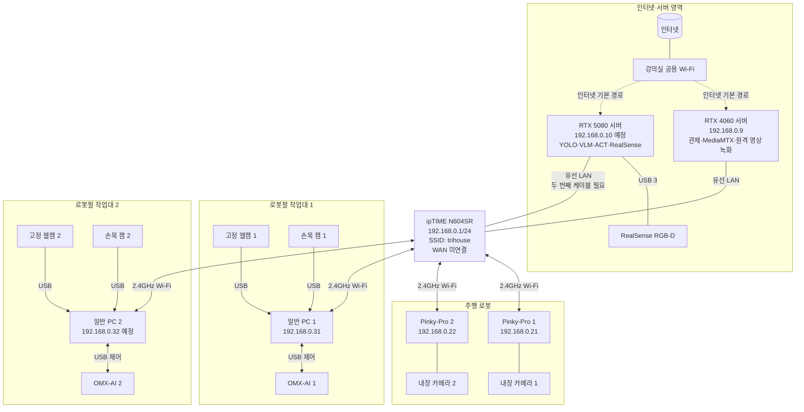
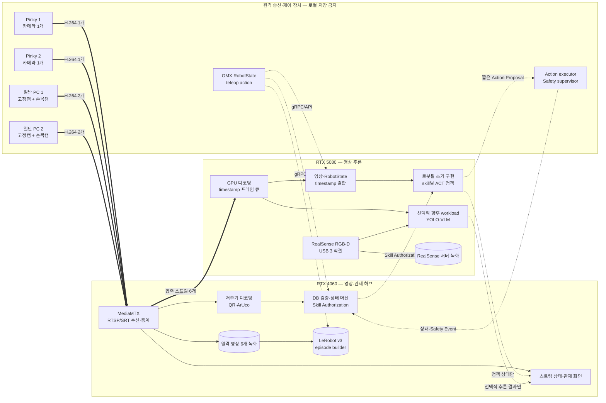

# Trihouse 영상 전송·추론·로봇 제어 아키텍처 5차 초안

> 상태: 카메라 포맷·처리량 검증 전 초안
>
> 작성일: 2026-08-05
>
> 범위: 네트워크, 카메라 연결, 영상 압축·전송·녹화, 서버 간 영상 경로, 스트림 장애 처리

로봇팔의 QR/DB 검증, 모방학습, 안전 제어 설계는 별도 문서인 [로봇팔 모방학습·안전 작업 수행 설계](./2026-08-05-robot-arm-imitation-safe-operation-draft.md)에서 다룬다.

## 1. 선택한 전송 구조

전송 방식은 **RTX 4060 서버의 MediaMTX를 중심으로 한 RTSP/SRT 중계 방식**으로 확정한다.

- Pinky-Pro와 일반 PC가 카메라 영상을 H.264로 압축해 RTX 4060으로 전송한다.
- RTX 4060은 원격 영상 6개를 다시 인코딩하지 않고 녹화·중계하며, QR·ArUco용 프레임만 저주기로 디코딩한다.
- RTX 5080은 로봇팔 초기 구현에서 authorization 이후 필요한 압축 스트림을 받아 ACT용으로 디코딩한다. YOLO·VLM은 로봇팔 승인·파지 경로와 분리된 선택적 향후 workload다.
- RealSense는 네트워크를 거치지 않고 RTX 5080에 USB 3로 직접 연결한다.
- 영상 본체는 ROS 2 메시지로 전송하지 않는다.
- 로봇 상태·skill authorization·Action Proposal은 영상과 분리된 gRPC 또는 내부 API로 전달한다.
- Pinky-Pro와 일반 PC에는 영상 파일을 저장하지 않는다.

## 2. 전체 카메라 구성

| 카메라 | 수량 | 연결 호스트 | 서버 전송 |
|---|---:|---|---|
| Pinky 내장 카메라 | 2 | Pinky-Pro 1·2 | H.264 → RTX 4060 |
| 고정 웹캠 | 2 | 일반 PC 1·2에 각각 USB | H.264 → RTX 4060 |
| OMX-AI 손목 캠 | 2 | 일반 PC 1·2에 각각 USB | H.264 → RTX 4060 |
| RealSense RGB-D | 1 | RTX 5080에 USB 3 직결 | 네트워크 전송 없음 |

총 카메라는 7대이며 N604SR 무선망을 통해 RTX 4060으로 들어오는 원격 영상은 6개다.

## 3. 물리·네트워크 아키텍처

### 3.1 물리/네트워크 연결



강의실 공용 Wi-Fi와 N604SR은 서로 다른 네트워크다. 서버 2대는 강의실 Wi-Fi를 인터넷 기본 경로로 사용하고, N604SR 유선 연결은 `192.168.0.0/24` 내부 통신에만 사용한다. 현재 LAN 케이블이 하나뿐이므로 RTX 4060만 연결할 수 있다. 6개 압축 스트림과 추론 제어를 안정적으로 운용하기 전에 두 번째 LAN 케이블을 준비해 N604SR의 남은 LAN 포트와 RTX 5080을 연결해야 한다. 한 개의 Wi-Fi 어댑터만으로 강의실 Wi-Fi와 `trihouse`에 동시에 접속하는 구성은 목표 구조로 사용하지 않는다.

### 3.2 영상 데이터 경로



## 4. 주소 계획

| 장치 | 연결 | 주소 | 상태 |
|---|---|---:|---|
| N604SR | 내부 LAN | `192.168.0.1` | 사용 중 |
| RTX 4060 서버 | N604SR 유선 | `192.168.0.9` | 등록 완료 |
| RTX 5080 서버 | N604SR 유선, 두 번째 LAN 케이블 필요 | `192.168.0.10` | 등록 예정 |
| Pinky-Pro 1 | N604SR Wi-Fi | `192.168.0.21` | 등록 완료 |
| Pinky-Pro 2 | N604SR Wi-Fi | `192.168.0.22` | 등록 완료 |
| 일반 PC 1 | N604SR Wi-Fi | `192.168.0.31` | 등록 완료 |
| 일반 PC 2 | N604SR Wi-Fi | `192.168.0.32` | 등록 예정 |
| OMX-AI 1 | 일반 PC 1 USB | IP 없음 | 예정 |
| OMX-AI 2 | 일반 PC 2 USB | IP 없음 | 예정 |
| RealSense | RTX 5080 USB 3 | IP 없음 | 확장 예정 |

## 5. 카메라·스트림 식별

| 카메라 ID | 게시 호스트 | RTX 4060 MediaMTX 경로 |
|---|---|---|
| `pinky_1` | Pinky-Pro 1 | `rtsp://192.168.0.9:8554/pinky_1` |
| `pinky_2` | Pinky-Pro 2 | `rtsp://192.168.0.9:8554/pinky_2` |
| `fixed_1` | 일반 PC 1 | `rtsp://192.168.0.9:8554/fixed_1` |
| `wrist_1` | 일반 PC 1 | `rtsp://192.168.0.9:8554/wrist_1` |
| `fixed_2` | 일반 PC 2 | `rtsp://192.168.0.9:8554/fixed_2` |
| `wrist_2` | 일반 PC 2 | `rtsp://192.168.0.9:8554/wrist_2` |
| `realsense_color` | RTX 5080 로컬 | 네트워크 경로 없음 |
| `realsense_depth` | RTX 5080 로컬 | 네트워크 경로 없음 |

RTSP/TCP로 먼저 검증하고 무선 손실이나 재접속 문제가 반복될 때 동일한 카메라 ID를 유지한 채 SRT로 전환한다.

## 6. 영상 압축·저장 규칙

### 6.1 원격 영상 초기 프로파일

| 항목 | 초기값 |
|---|---:|
| 코덱 | H.264 |
| 해상도 | `1280x720` |
| FPS | 10–15 |
| 비트레이트 | 스트림당 1.5–3Mbps |
| 키프레임 간격 | 1초 |
| 큐 정책 | 오래된 프레임 폐기, 최신 프레임 우선 |

### 6.2 인코딩 우선순위

1. 카메라가 H.264를 직접 출력하면 재인코딩하지 않는다.
2. MJPEG/YUYV만 출력하면 호스트의 하드웨어 H.264 인코더를 우선 사용한다.
3. 하드웨어 인코더가 없을 때만 `x264`를 사용하고 CPU 사용률을 측정한다.
4. RTX 4060은 원본 H.264를 그대로 녹화·중계하고, QR·ArUco용 최신 프레임만 5~10 FPS로 별도 디코딩한다.
5. RTX 5080은 로봇팔 초기 구현에서 authorization을 받은 ACT에 필요한 고정캠·손목캠만 디코딩하고 오래된 프레임을 폐기한다. 선택적 YOLO·VLM을 추가할 때도 필요한 스트림만 별도 구독한다.

### 6.3 로컬 저장 금지

- Pinky-Pro와 일반 PC 1·2에는 영상 파일이나 이미지 데이터셋을 저장하지 않는다.
- 송신에 필요한 제한된 RAM 버퍼만 허용한다.
- 네트워크가 끊겨도 로컬 파일 녹화로 전환하지 않는다.
- 원격 영상 6개는 RTX 4060에만 저장한다.
- OMX-AI의 관절·그리퍼 상태, teleop action과 상태 머신 이벤트도 RTX 4060에 저장한다.
- LeRobot v3 데이터셋은 RTX 4060의 영상·telemetry를 timestamp로 결합해 생성한다.
- RealSense RGB·Depth는 RTX 5080에만 저장한다.

### 6.4 RealSense 저장

- RGB: 필요하면 H.264로 저장
- Depth: 16비트 거리값을 보존하는 무손실 형식 또는 RealSense 전용 녹화 형식
- 함께 기록: capture timestamp, frame ID, serial number, camera intrinsics, depth scale
- 캡처·녹화 프로세스와 모델 추론 프로세스를 분리한다.

## 7. ROS 2와 영상 전송 경계

ROS 2로 보내지 않는 데이터:

- 연속 `sensor_msgs/Image`
- 프레임 단위 JPEG/PNG 전체 영상
- H.264 조각 또는 base64 영상
- RealSense Depth·Point Cloud 연속 데이터

ROS 2 또는 내부 API로 보내는 데이터:

- 카메라 연결 상태, FPS, 비트레이트, 마지막 프레임 시각
- OMX-AI 관절·그리퍼 상태와 teleop action
- 객체 검출·분할·추적 결과
- QR/Aruco 인식 결과
- 관제 이벤트와 안전 상태
- 1회용 Skill Authorization
- 유효시간이 있는 Action Proposal과 실행 결과

영상 전송은 RTSP/SRT를 사용한다. 모방학습 경로의 로봇 상태·authorization·Action Proposal은 gRPC 또는 명시적인 내부 API를 사용하며 ROS 2 영상 메시지에 섞지 않는다. 첨부 강의의 기본 LeRobot 비동기 RobotClient처럼 카메라 배열을 pickle/gRPC로 중복 전송하지 않는다.

## 8. 스트림 단절 정의와 대응

`스트림 단절`은 지정 시간 동안 해당 카메라에서 유효한 새 프레임을 받지 못하는 상태다.

### 8.1 발생 상황

1. Pinky 또는 일반 PC의 Wi-Fi 연결 해제
2. N604SR 재부팅·전파 간섭·거리 문제
3. USB 카메라 분리·전원 부족·드라이버 오류
4. GStreamer/FFmpeg 송신 프로세스 종료
5. MediaMTX 게시 세션 종료 또는 RTX 4060 서비스 장애
6. 연결은 유지되지만 frame ID나 timestamp가 증가하지 않는 freeze
7. RTX 5080 디코더 오류
8. RealSense USB 분리, USB 2로 강등, RGB 또는 Depth 한쪽 정지
9. 일반 PC의 `RobotState` sequence·timestamp가 증가하지 않음
10. RTX 5080 정책 서버 heartbeat 또는 Action Proposal timeout

### 8.2 상태 판정 초기값

| 상태 | 초기 판정 기준 |
|---|---|
| `DEGRADED` | 1초 이상 새 프레임 없음 또는 FPS가 목표의 50% 미만 |
| `DISCONNECTED` | 3초 이상 새 프레임 없음, 게시 세션 종료, USB 장치 제거 |
| `RECOVERING` | 재접속 중이며 아직 정상 FPS에 도달하지 않음 |
| `HEALTHY` | 5초 연속 목표 FPS의 90% 이상이며 timestamp가 계속 증가 |

단절된 카메라의 마지막 프레임을 반복해 모델에 넣지 않는다. 해당 영상 또는 RobotState에 의존하는 로봇 동작은 중단하고 일반 PC의 남은 action queue와 active authorization을 즉시 폐기한 뒤 안전 정지 상태를 유지한다. 송신 장치는 로컬 녹화로 전환하지 않고 RAM 버퍼를 폐기한 뒤 제한된 backoff로 재접속한다. 재연결 후에도 새 QR·ArUco·DB 검증과 새 authorization 없이는 작업을 재개하지 않는다.

## 9. 최종본을 위한 확인 방법

### 9.1 일반 PC의 두 USB 카메라 식별

```bash
v4l2-ctl --list-devices
```

재부팅 때 `/dev/video0` 번호가 바뀔 수 있으므로 운영 서비스에서는 `/dev/v4l/by-id/` 경로를 사용한다.

### 9.2 지원 포맷·해상도·FPS

```bash
v4l2-ctl -d /dev/video0 --list-formats-ext
```

고정캠과 손목캠 각각에 대해 H264, MJPG, YUYV 지원 여부와 720p/1080p FPS를 기록한다.

### 9.3 인코더 확인

```bash
gst-launch-1.0 --version
gst-inspect-1.0 x264enc
gst-inspect-1.0 vah264enc
gst-inspect-1.0 vaapih264enc
```

### 9.4 Wi-Fi 절전 확인

```bash
iw dev wlo1 get power_save
nmcli -g 802-11-wireless.powersave connection show trihouse
```

기대 결과는 각각 `Power save: off`, `disable`이다.

### 9.5 네트워크 측정

RTX 4060:

```bash
iperf3 -s
```

각 무선 호스트:

```bash
iperf3 -c 192.168.0.9 -t 30
ping -c 50 -i 0.2 192.168.0.9
```

### 9.6 RealSense 확인

RTX 5080:

```bash
rs-enumerate-devices
```

USB 3 연결, serial number, RGB·Depth 프로파일, intrinsics, depth scale, 10분 동시 캡처 드롭 수를 기록한다.

## 10. 영상 아키텍처 합격 기준

| 항목 | 기준 |
|---|---|
| 원격 영상 | H.264 6개 스트림이 각각 720p 10–15fps로 10분 유지 |
| 무선 지연 | 패킷 손실 0%, 평상시 평균 20ms 이하 목표 |
| 프레임 드롭 | 추론 입력 기준 1% 이하 목표 |
| 원격 녹화 | RTX 4060에 카메라별 재생 가능한 파일 생성 |
| QR·ArUco | RTX 4060이 필요한 스트림만 5~10fps로 디코딩하고 marker observation 생성 |
| 데이터 동기화 | 영상·RobotState·teleop action의 capture timestamp 차이가 초기 목표 ±50ms 이내 |
| 정책 통신 | RTX 5080이 `pick/place_shelf/place_basket`별 짧은 Action Proposal 반환 |
| RealSense | RTX 5080에서 RGB·Depth 10분 동시 캡처, timestamp 역행 없음 |
| 로컬 저장 금지 | Pinky·일반 PC 영상 파일 생성 0건 |
| 단절 복구 | action queue·authorization이 폐기되고, 재접속 후 새 검증 없이는 작업이 재개되지 않음 |

720p 10fps, 스트림당 약 1.5Mbps에서도 원격 6개가 불안정하면 N604SR을 기가비트 LAN과 5GHz/Wi-Fi 6를 지원하는 AP로 교체하는 것을 우선 검토한다.
