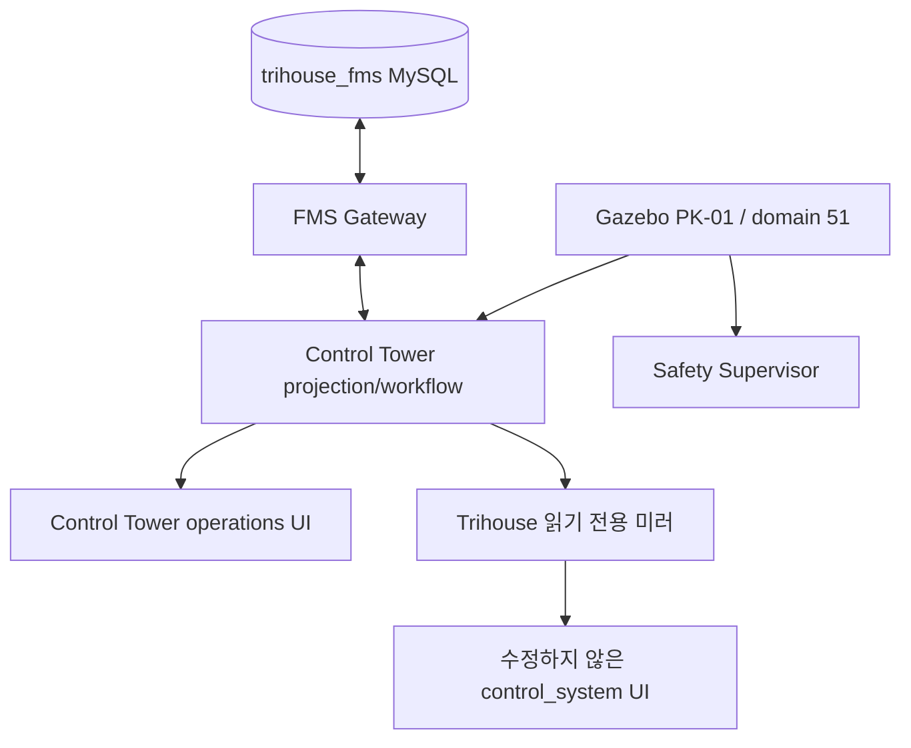

# Trihouse Gazebo-관제 시스템 시뮬레이션 검증 계획

## Goal Capsule

Ubuntu ROS 2 Jazzy 환경에서 Gazebo Pinky, MySQL/FMS Gateway, Control Tower,
읽기 전용 RoboSapiens `control_system` UI까지를 단계별로 검증할 수 있는
재현 가능한 경로를 만든다.

한 번에 전체를 띄우지 않는다. DB/Gateway, Gazebo/Safety Supervisor,
Control Tower 읽기 모델, RoboSapiens 호환 미러 순서로 경계를 먼저 증명한다.
`trihouse_fms`는 입출고ㆍ재고ㆍ작업의 유일한 운영 사실 원천이며,
`control_system`은 수정하지 않는 표시 전용 외부 워크트리다.

현재 공유기 설정은 되어 있으나 관제 네트워크와 실제로 연결하지 않았으므로,
**실장비 TCP 연결은 아직 검증 대상이 아니다.** TCP 메시지 형식과 핸드셰이크는
루프백/모의 수신기로 먼저 검증하고, 공유기 연결 후 별도의 실연결 증거를 남긴다.
이는 저장소에 Control Tower 수신 서버 구현이 필요한지와는 다른 런타임 전제다.

Safety Supervisor가 유일한 `/cmd_vel` 발행자가 아니거나, 필수 센서가 stale 상태이거나,
정지 확인 응답이 실패하면 즉시 해당 시뮬레이션을 실패로 기록하고 중단한다.

## Product Contract

### Problem Frame

저장소에는 v3 MySQL/FMS Gateway, Gazebo Pinky 오버레이, 메모리 기반 Control
Tower UI, SQLite/FleetEngine 및 TCP 8788 프로토콜을 쓰는 읽기 전용 RoboSapiens
Flutter 앱이 각각 존재한다. 필요한 것은 단순 기동 확인이 아니라, 모의 로봇 상태와
통제된 작업/안전 전이가 UIㆍ벤더 코드에 권한을 주지 않고 하나의 FMS 소유 경로로
관측되는지 증명하는 일이다.

### Requirements

- R1. Ubuntu, ROS 2 Jazzy, Gazebo, Docker Compose, MySQL, Flutter, 맵 자산,
  `ROS_DOMAIN_ID`를 통합 기동 전에 판정ㆍ기록한다.
- R2. 개발용 MySQL 볼륨보다 먼저 격리된 테스트 DB에서 `trihouse_fms` 스키마,
  seed, Gateway 읽기 API, 재고 멱등성, 시간대를 검증한다.
- R3. 두 로봇 모두 `ROS_DOMAIN_ID=52`를 공유하고 namespace 로 구분한다. PK-01(`pinky_01`)을 먼저 검증하고 PK-02(`pinky_02`)는 그 다음에
  격리 검증한다. `robot_id`는 DDS 격리 수단이 아니다.
- R4. Gazebo bringup, Nav2 준비, 모의 적재/인계, 안전 정지와 단일 `/cmd_vel` 권한을
  검증하되, 실제 OMX/하드웨어 구동 명령은 보내지 않는다.
- R5. Control Tower는 FMS 사실과 Pinky 상태를 명시적 adapter/projection으로 묶는다.
- R6. 관제 UI는 Gateway REST/WebSocket만 사용하며 MySQLㆍRMFㆍROS에 직접 연결하지 않는다.
- R7. 이후 `control_system/robo_control`은 수정 없이 Trihouse 소유 읽기 전용 호환
  미러를 통해 Control Tower 배포의 표시 구성요소가 된다.
- R8. RoboSapiens 미러는 Pinky TCP 8788과 다른 endpoint를 사용하고, 작업ㆍ재고ㆍ주행을
  생성하거나 변경하지 않는다.
- R9. 모든 gate를 통과/실패/차단으로 기록하고, 명령 출력ㆍ버전ㆍ맵 revisionㆍROS domainㆍ
  commit SHA를 남긴다. Gazebo 결과를 실기기 결과로 표현하지 않는다.

### Scope Boundaries

**범위 포함:** Gazebo/모의 센서/OMX adapter, MySQL/FMS Gateway 통합 테스트,
FMS+Pinky 상태의 Control Tower projection, 읽기 전용 RoboSapiens 미러,
재현 가능한 문서와 notebook.

**범위 제외:** `control_system/`, `pinky_pro/`, 벤더 프로토콜 정의 수정, 실제 OMX/그리퍼/
Pinky 검증, 사람 쓰러짐(SR52) 구현, VLM/RL recovery 구현 및 DB migration,
RoboSapiens SQLite/FleetEngine을 FMS 권한으로 만드는 일.

### Key Flows

- F1. **DB 기준선:** 격리 MySQL에 schema/seed를 적용하고 Gateway health/read API와
  멱등 재고 조정의 영속 결과를 확인한다.
- F2. **단일 로봇:** domain 51의 PK-01 Gazebo가 준비/상태를 보고하고 Safety Supervisor가
  유일한 속도 명령 권한을 유지한다.
- F3. **관제 projection:** FMS job/device와 Pinky 상태가 하나의 operations snapshot 및
  순서 보장 event가 되어 UI에 보인다.
- F4. **벤더 UI 미러:** Trihouse adapter가 projection을 벤더 telemetry 형태로 일방향 변환해
  UI에 표시한다. FMS 자격증명이나 명령 권한은 전달하지 않는다.

## Planning Contract

### Key Technical Decisions

- KTD1. **전체 스택보다 경계를 먼저 증명한다.** (session-settled: user-approved)
- KTD2. **v3 FMS가 유일한 운영 사실 원천이다.** (session-settled: user-directed)
- KTD3. **Control Tower가 통합 소유자이고 RoboSapiens는 읽기 전용 호환 화면이다.**
  (session-settled: user-directed)
- KTD4. **전송 프로토콜을 분리한다.** Pinky는 `execute_transport`/`robot_status` 계약을,
  호환 미러는 별도 접속 경로의 벤더 계약을 사용한다.
- KTD5. **현재 UI/FMS 결합은 증명되지 않았다.** Gateway는 devices/inventory/jobs만,
  OperationsHttpServer는 메모리 feed만 제공한다. DB-backed UI를 주장하기 전에 projection을
  테스트로 명시한다.
- KTD6. **시뮬레이션 증거는 시뮬레이션 주장에만 쓴다.**
- KTD7. **현재 TCP 부재는 네트워크 미연결 상태다.** 공유기/실장비 연결 전에는 loopback
  수신기로 protocol을 검증하고, 실제 연결은 후속 환경 gate에서 별도 검증한다.

### High-Level Technical Design

맵ㆍNav2는 Gazebo/ROS에 남고 UI는 projection만 소비한다. 벤더 UI에서 명령ㆍ작업ㆍ재고ㆍ
예약ㆍincident 변경이 Control Tower/FMS로 되돌아오는 경로는 없다.

### Assumptions and Risks

- 1차 통합은 Ubuntu+ROS 2 Jazzy+Gazebo+Docker Compose+Flutter가 설치된 환경에서 수행한다.
  macOS 작업공간은 정적/단위 검증용이다.
- 맵 YAML과 참조 이미지가 기동 전에 제공되어야 한다.
- Pinky Gateway는 TCP 8788을 예약하고, 호환 미러는 별도 설정 endpoint를 사용한다.
- 공유기/실장비 네트워크 연결 전에는 **실연결 검증을 pass로 기록하지 않는다.**

| 위험 | 영향 | 완화 gate |
| --- | --- | --- |
| FMS와 Control Tower 읽기 모델 불일치 | UI가 DB 상태를 잘못 표시 | fixture 기반 projection 계약 테스트 |
| TCP 8788 충돌 | Pinky가 다른 서버에 연결 | 8788은 Pinky만, 미러는 별도 port |
| 공유기 미연결 | 실장비 TCP 증거 부재 | loopback 검증 후 후속 실연결 gate |
| RoboSapiens가 2차 권한이 됨 | 중복 dispatch/재고 변경 | outbound telemetry 전용, inbound 거부 |
| `/cmd_vel` 발행자 둘 이상 | 안전하지 않은 모의 주행 | 매 시나리오 hard-stop 검사 |

## Implementation Units

### U1. 검증 환경과 증거 계약을 재현 가능하게 만든다

- **목표:** 흩어진 bringup 정보를 static/test-DB/Gazebo/hardware 증거로 구분한 하나의
  gate 기반 체크리스트로 만든다.
- **요구사항:** R1, R3, R4, R9. **의존성:** 없음.
- **파일:** `docs/deployment/local_simulation_demo.md`,
  `docs/validation/notebooks/gazebo_hardware_check.ipynb`,
  `trihouse_pinky/test/test_integrated_bringup_contract.py`.
- **접근:** domain/port 소유 행렬, 통과ㆍ실패ㆍ중단 기준, run record 양식을 정의한다.
  TCP는 `loopback mock`과 `공유기 연결 후 실연결`을 별도 gate로 명시한다.
- **테스트:** physical/Gazebo launch parameter 일치, PK-01=51/PK-02=52 문서화,
  모든 통합 시나리오의 단일 `/cmd_vel` 및 stop 조건 선언.
- **완료 증거:** 운영자가 기동 전 결손을 분류하고 각 결과에 run record를 붙일 수 있다.

### U2. 격리 MySQL과 FMS Gateway 기준선을 만든다

- **목표:** simulator/UI보다 먼저 v3 운영 schema와 Gateway를 증명한다.
- **요구사항:** R2, R9. **의존성:** U1.
- **파일:** `compose.db_test.yaml`, `db/schema_mysql.sql`, `db/seed_dev.sql`,
  `fms_gateway/app/main.py`, `fms_gateway/app/repositories.py`,
  `fms_gateway/tests/integration/`, `docs/deployment/database_demo.md`.
- **테스트:** 빈 DB schema/seed/read, 같은 idempotency key의 단일 재고 변경/audit,
  MySQL 불가 시 readiness 실패, Seoul-offset timestamp 일관성.
- **완료 증거:** 개발 DB나 브라우저 이전에 tmpfs MySQL gate가 통과한다.

### U3. FMS→Control Tower operations projection을 테스트로 추가한다

- **목표:** 수동 메모리 feed가 아닌 FMS 레코드+Pinky 상태의 명시적 projection을 만든다.
- **요구사항:** R5, R6, R9. **의존성:** U2.
- **파일:** `control_tower/gateway/operations_feed.py`, `http_server.py`,
  `control_tower/database/`, `control_tower/tests/`, `fms_gateway/app/models.py`,
  `repositories.py`, `fms_gateway/tests/integration/test_read_api.py`.
- **테스트:** 동일 FMS fixture+PK-01 상태의 snapshot, safety event 우선 정렬,
  stale FMS의 degraded 표시, UI의 MySQL/ROS/RMF 직접 접근 부재.
- **완료 증거:** UI가 Control Tower HTTP/WebSocket만 통해 DB 기반 seed와 모의 상태를 보인다.

### U4. Pinky 전송 수신과 단일 Gazebo PK-01을 검증한다

- **목표:** Gazebo overlay를 projection에 연결하고 PK-01 안전 시나리오 하나를 관측한다.
- **요구사항:** R3-R6, R9. **의존성:** U1-U3.
- **파일:** `control_tower/gateway/pinky_transport_server.py`,
  `control_tower/tests/test_pinky_transport_server.py`, `trihouse_pinky/.../gateway_node.py`,
  Gazebo launch/adapter/contract test, notebook.
- **접근:** 현재 공유기/실장비는 미연결이므로 먼저 loopback 수신기로 `hello`, `robot_status`,
  `task_event`, heartbeat, ACK 계약을 검증한다. 저장소의 Control Tower 안에 이 계약을 받을
  수신 코드가 없으면 그때만 Trihouse 소유 서버를 추가한다. 이 구현 공백과 네트워크 미연결을
  혼동하지 않는다. 실연결은 연결 후 별도 gate로 수행한다.
- **테스트:** valid hello/status/heartbeat→projection, malformed/stale/duplicate 거부,
  cargo/handover gate, emergency/keep-out/link-loss의 zero velocity와 incident,
  duplicate command 단일 action, 두 번째 `/cmd_vel`/stale sensor hard fail.
- **완료 증거:** Gazebo/FMS/UI/ROS 관측과 pass/fail verdict를 담은 PK-01 run record.

### U5. Control Tower 아래 읽기 전용 RoboSapiens 호환 미러를 만든다

- **목표:** 벤더 파일을 건드리지 않고 `control_system`을 나중 관제 배포의 표시 요소로 준비한다.
- **요구사항:** R7-R9. **의존성:** U3, U4.
- **파일:** `control_tower/gateway/`, `control_tower/tests/`, 관련 setup/checklist 문서.
- **테스트:** snapshot→vendor telemetry 변환, Pinky 8788 점유 금지, inbound command 거부,
  vendor UI 표시 중 FMS/명령 queue 무변경.
- **완료 증거:** 수정하지 않은 UI가 PK-01 projection을 보되 권한/자격증명은 갖지 않는다.

### U6. 단계별 notebook과 acceptance evidence를 완성한다

- **목표:** 무엇이 증명됐고 무엇이 simulation-only인지 운영자가 재현하게 한다.
- **요구사항:** R1-R9. **의존성:** U1-U5.
- **파일:** notebook, bringup guide, implementation map, `README.md`.
- **테스트:** 모든 acceptance step이 source test/runtime observation/blocked prerequisite 중 하나에
  매핑되고, static/MySQL/Gazebo/hardware 증거가 구분되며, 벤더 수정 지시가 없는지 확인한다.
- **완료 증거:** 리뷰어가 순서를 재현하고 차단된 단계의 정확한 전제조건을 식별한다.

## Verification Contract

| Gate | 증거 | 완료 신호 |
| --- | --- | --- |
| Static contract | Python/source contract test | launch/프로토콜/workflow 유효 |
| FMS 통합 | MySQL tmpfs suite | schema/seed/read/atomic/idempotency 통과 |
| Control Tower projection | adapter/UI contract | FMS+모의 상태 단일 snapshot |
| Gazebo 단일 로봇 | topic/action/launch 관측 | PK-01 안전ㆍUI 표시ㆍ`/cmd_vel` 단일 권한 |
| Gazebo 실패 경로 | emergency/cargo/link-loss | STOP/hold 관측, unsafe 완료 없음 |
| 실제 TCP 연결 | 공유기 연결 후 접속 기록 | 별도 endpoint/handshake/상태 수신 증거 |
| RoboSapiens 미러 | read-only adapter+UI | UI 표시, 권한/자격증명 없음 |

## Definition of Done

- Ubuntu preflight가 Gazebo 전 필수 조건 누락을 보인다.
- MySQL/FMS Gateway suite가 ROS/Gazebo와 독립적으로 통과한다.
- operations snapshot은 테스트 메모리만이 아닌 FMS+Pinky 상태에서 유도된다.
- domain 51 PK-01이 안전 시나리오와 통제된 실패 시나리오를 기록한다.
- PK-02/domain 52는 PK-01 안정화 뒤에만 격리 검증한다.
- `control_system`은 변경하지 않으며, 호환 미러는 FMS mutation/로봇 명령 권한이 없다.
- simulation, 실제 TCP, hardware/OMX, 낙상 감지, VLM/RL recovery의 검증 상태가 문서에서 분리된다.

## Appendix

### 현재 증거와 공백

- `trihouse_pinky_bringup/launch/trihouse_gazebo_demo.launch.py`는 Pinky simulation,
  mock hardware, Gazebo OMX adapter, Nav2, Safety Supervisor 경계를 이미 조합한다.
- `fms_gateway`는 MySQL schema/read API와 멱등 재고 조정을 증명하지만 devices/inventory/jobs만
  노출한다.
- `control_tower/gateway/http_server.py`는 Gateway-only UI 계약은 있으나 feed가 메모리 기반이라
  DB 주장 전 FMS/status projection이 필요하다.
- `control_system/robo_control`은 다른 TCP 계약의 SQLite/FleetEngine 앱이며 직접 수정 대신
  외부 읽기 전용 adapter/wrapper를 사용해야 한다.
