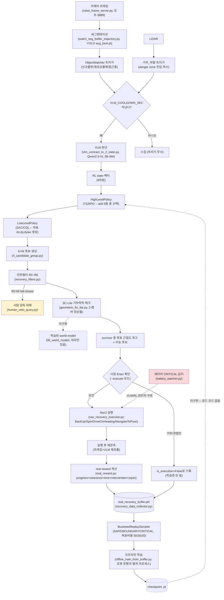

# 전체 아키텍처 — VLM+RL+buffer 흐름

`EVOLUTION.md`가 파일별 변천사라면 이 문서는 "지금 데이터가 어떤 순서로 어디를 거쳐서
흐르는지"를 한눈에 보는 용도. 실선=실측 검증된 흐름, 점선=미구현/미연결.

## 그림에서 놓치기 쉬운 것 3가지

1. **`checkpoint → HighLevelPolicy` 화살표가 점선인 이유**: 학습은 되는데, 학습된 checkpoint를
   로드해서 실제 관제(다음 트리거 때 이 정책을 쓰는 것)에 연결하는 코드가 없음
   (`recovery_system_node.py`가 TODO 상태 — `EVOLUTION.md` "다음 사람이 알아야 할 것" 참고).
   지금은 매번 학습만 하고 그 결과를 실제로 "써먹는" 배선이 빠져있는 상태.
2. **배터리 CRITICAL은 그림 왼쪽 전체를 건너뜀**: VLM도, RL도, 안전필터도 전혀 안 거치고
   곧바로 Nav2로 감(결정론적 규칙, `battery_watcher.py`) — 그림에 점선 화살표로 우회를
   표시해둔 이유.
3. **`OBS_ONLY`(사람이 관찰만 한 경우)도 buffer에 들어가긴 함**: 다만 `is_execution=False`
   태그가 붙어서 학습 시(`offline_train_from_buffer.py`) 필터링돼서 안 쓰임 — buffer에
   "있다"와 "학습에 쓰인다"는 다른 이야기.
