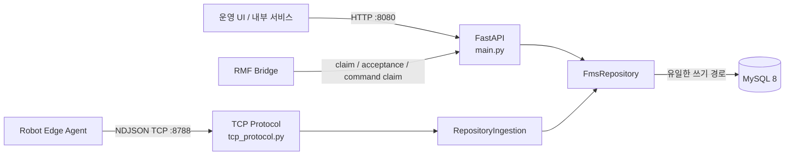
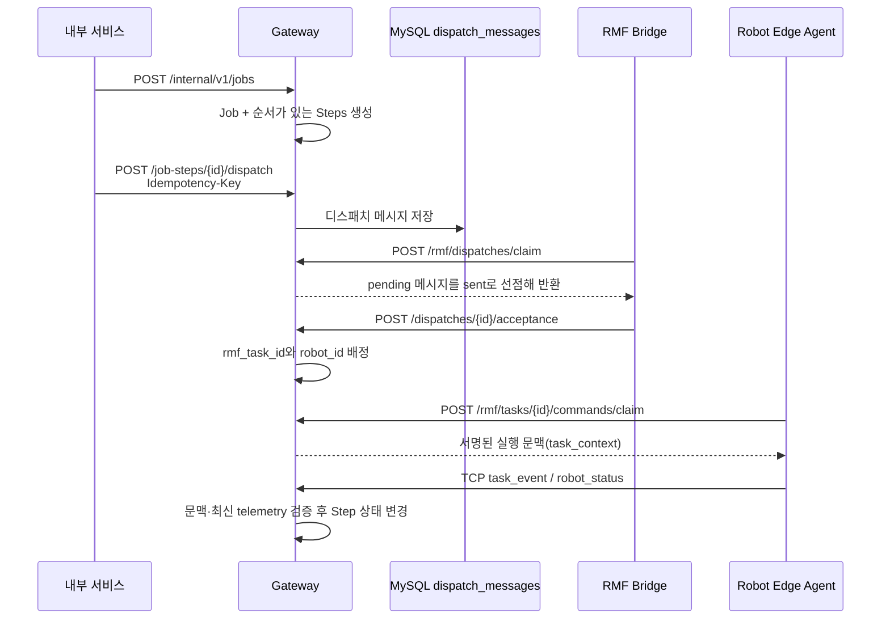

# Trihouse FMS Gateway

## 1. FMS Gateway란?

FMS(Fleet Management System)는 여러 로봇과 설비에 **어떤 작업을, 어떤 순서로, 누구에게 수행시킬지** 결정하고 그 결과를 하나의 운영 상태로 관리하는 계층이다. 이 프로젝트의 Gateway는 외부 시스템과 로봇이 FMS 데이터에 직접 접근하지 않도록 중앙 경계를 제공한다.

이 코드에서 Gateway는 단순 HTTP 프록시가 아니다. 다음 책임을 한 프로세스에 모은 **FMS의 단일 쓰기 주체(single writer)** 이다.

- 운영 화면/내부 서비스가 사용하는 HTTP API 제공
- 작업(Job)과 작업 단계(Job Step)의 생성·조회·디스패치
- RMF(Robotics Middleware Framework) 브리지와 작업 인계
- 로봇이 보내는 상태와 작업 이벤트를 TCP/NDJSON으로 수신
- 지도 초안 검증 및 불변(immutable) 리비전 발행
- 재고 수량 변경과 감사 이력 기록
- 위 변경을 MySQL 트랜잭션과 이벤트 타임라인에 일관되게 반영

즉, 다른 구성요소는 Gateway의 API와 프로토콜을 통해서만 FMS 상태를 읽거나 바꾸고, Gateway가 도메인 규칙·동시성·멱등성을 한곳에서 보장한다.

## 2. 전체 구조



계층별 역할은 다음과 같다.

| 계층 | 코드 | 역할 |
|---|---|---|
| 설정 | `app/config.py` | `FMS_DB_*`, `FMS_TCP_*` 환경 변수를 타입 안전한 설정으로 변환 |
| HTTP 경계 | `app/main.py` | 요청 검증, Repository 호출, 도메인 예외를 HTTP 상태 코드로 변환 |
| TCP 경계 | `app/tcp_protocol.py` | hello 기반 세션 고정, 스키마/순서 검증, ACK 또는 거절 응답 |
| 수집 어댑터 | `app/ingestion.py` | 검증된 TCP 메시지를 동기 Repository 작업으로 전달 |
| 데이터 계약 | `app/models.py` | FastAPI 요청/응답 Pydantic 모델과 필드 규칙 |
| 영속성/도메인 | `app/repositories.py` | SQL, 트랜잭션, 상태 전이, 멱등성, 지도 검증/발행 |
| 결과 분류 | `app/outcomes.py` | 실행 사실을 안정적인 원인 코드와 장애 도메인으로 분류 |
| 예약 계산 | `app/reservations.py` | 서울 시간 기준 자원 예약의 가장 빠른 빈 구간 계산 |
| DB 연결 | `app/database.py` | MySQL 연결 풀 및 세션 시간대/롤백 수명주기 관리 |

`MySqlFmsRepository`가 실제 운영 구현이고, `InMemoryFmsRepository`는 DB 없이 API·상태 전이를 검증하는 단위 테스트용 구현이다. `FmsRepository` Protocol 덕분에 FastAPI는 어느 구현인지 알 필요가 없다.

## 3. 주요 실행 흐름

### 3.1 Job 생성부터 로봇 실행까지



1. Job은 하나 이상의 순서 있는 Step으로 생성된다.
2. 현재 실행 가능한 Step만 디스패치할 수 있다. 앞선 Step이 성공하지 않았거나 이미 활성 메시지가 있으면 `409`가 된다.
3. RMF 브리지가 대기 메시지를 claim하면 `pending → sent`로 바뀐다.
4. RMF가 수락하면서 `rmf_task_id`와 실제 `assigned_device_id`가 Step에 연결되고 assignment revision이 증가한다.
5. 로봇은 명령 실행 전 command claim으로 `task_context`를 받는다. 이후 상태/이벤트의 Job, Step, RMF task, command, map revision이 이 문맥과 정확히 일치해야 한다.
6. 로봇의 `started/arrived/failed/canceled` 이벤트가 Step 상태와 타임라인을 갱신한다. `arrived`는 최근 2초 이내의 같은 세션 telemetry, 정지 속도, 안전 상태, navigation 상태까지 확인한다.

### 3.2 로봇 TCP 수집

TCP 포트는 줄마다 JSON 하나를 보내는 NDJSON 프로토콜을 사용한다. 연결 하나는 첫 `hello`가 지정한 `robot_id`와 `session_id`에 영구적으로 묶인다.

```text
hello (schema_version=3)
  └─ 성공: hello_accepted ACK
      ├─ robot_status: sequence가 이전 값보다 커야 함
      ├─ task_event: started/arrived/canceled/failed
      └─ heartbeat
```

- 등록된 mobile robot만 연결할 수 있다.
- 모든 메시지는 현재 `SCHEMA_VERSION = 3`이어야 한다.
- status의 `sequence`는 연결 안에서 단조 증가해야 하며 재전송된 과거 값은 `STALE_SEQUENCE`로 거절한다.
- 한 줄은 기본 65,536바이트 이하이며 초과 시 연결을 종료한다.
- TCP 스키마 오류는 연결 장애가 아니라 안정적인 `event_rejected.reason_code`로 돌려준다.
- `RepositoryIngestion`은 블로킹 DB 작업을 `asyncio.to_thread`로 옮겨 TCP 이벤트 루프를 막지 않는다.

### 3.3 지도 초안과 발행

지도는 수정 가능한 **project draft**와 실행에 쓰는 **published revision**을 분리한다.

1. 저장 시 waypoint/lane UUID를 유지하거나 새로 만들고, 좌표가 같은 기존 항목의 식별자·location code·map pose를 가능한 한 보존한다.
2. `If-Match`의 draft revision을 행 잠금 상태에서 확인해, 오래된 편집기가 새 변경을 덮지 못하게 한다(낙관적 잠금).
3. 검증은 UUID/이름/location code 중복, lane endpoint, robot/charger/fleet 연결 등을 확인한다.
4. 발행 시 building/nav graph/world 내용의 SHA-256과 요청 해시가 같은지, `map_revision`이 세 artifact의 해시로부터 결정적으로 만들어졌는지 확인한다.
5. 같은 revision 이름에 다른 콘텐츠를 넣을 수 없다. 성공한 revision은 실행 시 재현 가능한 불변 산출물이다.

### 3.4 재고 조정

재고 조정은 lot 행을 `FOR UPDATE`로 잠근 트랜잭션에서 수행한다.

- lot이 없으면 `404`
- 조정 결과의 가용 수량이 예약 수량보다 작아지면 `409`
- 같은 `Idempotency-Key`와 같은 요청은 기존 결과 반환
- 같은 키를 다른 요청에 재사용하면 `409`
- 성공 시 lot 수량, 재고 이동 이력, 멱등성 응답을 함께 commit

## 4. 일관성을 지키는 핵심 규칙

### 단일 쓰기 주체

모든 MySQL 변경을 Gateway Repository로 집중한다. 여러 프로세스가 서로 다른 규칙으로 같은 상태를 갱신하는 일을 막고, 상태 변경과 이벤트/감사 기록을 하나의 트랜잭션으로 묶는다.

### 트랜잭션과 행 잠금

상태를 판정한 뒤 갱신하는 경로는 `SELECT ... FOR UPDATE`로 경쟁 요청을 직렬화한다. Repository가 명시적으로 `commit()`하지 못하고 빠져나오면 `Database.connection()`이 열린 트랜잭션을 rollback한다.

### 멱등성

네트워크 재시도는 정상 상황이므로, 재고 조정과 Step 디스패치는 `Idempotency-Key`를 요청 지문과 함께 저장한다. 같은 의도의 재시도는 같은 결과를 얻고, 같은 키의 다른 의도는 충돌로 처리한다.

### 시간대

MySQL 연결마다 `SET time_zone = '+09:00'`을 실행한다. DB에 쓰는 aware datetime은 서울 시간의 naive 값으로 바꾸고, 조회한 naive datetime은 `Asia/Seoul` aware 값으로 복원한다. 예약 계산도 반드시 `+09:00` aware datetime만 받는다.

### 실행 문맥

로봇 이벤트는 robot ID만 맞는다고 신뢰하지 않는다. Job/Step ID, assignment revision, RMF task ID, command ID, map revision과 command source가 서버가 발급한 claim과 일치해야 한다. 이는 늦게 도착한 이전 작업의 이벤트가 새 작업을 완료시키는 것을 방지한다.

## 5. HTTP API 요약

| 구분 | Method / Path | 기능 |
|---|---|---|
| 상태 | `GET /health` | 프로세스 생존 확인 |
| 상태 | `GET /ready` | MySQL 연결 가능 여부 확인 |
| 조회 | `GET /api/v1/devices` | 활성 장치와 최신 상태 조회 |
| 조회 | `GET /api/v1/inventory/lots` | 재고 lot 조회 |
| 변경 | `POST /api/v1/inventory/lots/{lot_id}/adjust` | 멱등 재고 수량 조정 |
| 조회 | `GET /api/v1/jobs` | Job 목록 조회 |
| 조회 | `GET /api/v1/jobs/{job_id}` | Job과 Step 상세 조회 |
| 조회 | `GET /api/v1/jobs/{job_id}/timeline` | Job 이벤트 타임라인 조회 |
| 조회 | `GET /api/v1/operation-events?from=&to=&before_at=&before_event_id=&limit=` | 전역 운영 이벤트 기간/keyset cursor 조회 |
| 지도 | `GET/PUT/DELETE /internal/v1/map-projects/{map_name}` | 지도 초안 조회·저장·삭제 |
| 지도 | `POST /internal/v1/map-projects/{map_name}/validate` | 지도 초안 검증 |
| 지도 | `POST /internal/v1/map-projects/{map_name}/publish` | 검증된 artifact revision 발행 |
| 지도 | `POST /internal/v1/map-projects/{map_name}/changes` | UI 지도 변경 감사 이벤트 추가 |
| 지도 | `GET /internal/v1/maps/{map_name}/published` | 최신 발행 지도 조회 |
| Job | `POST /internal/v1/jobs` | Job과 Step 생성 |
| Job | `POST /internal/v1/job-steps/{id}/dispatch` | 현재 Step 디스패치 |
| RMF | `POST /internal/v1/rmf/dispatches/claim` | RMF 대기 메시지 선점 |
| RMF | `POST /internal/v1/rmf/dispatches/{id}/acceptance` | RMF 수락/실패 결과 기록 |
| Robot | `POST /internal/v1/rmf/tasks/{id}/commands/claim` | 로봇 실행 문맥 발급 |

`/api/v1`은 운영 조회/조정 경계, `/internal/v1`은 지도 도구·RMF 브리지·내부 오케스트레이션 경계로 사용된다. 현재 코드에는 별도 인증 미들웨어가 없으므로 배포 시 내부 네트워크 또는 상위 프록시에서 접근 제어해야 한다.

Waypoint 운영 역할, 영문 명칭, 병목 반경/mutex, `locations` 투영 규칙은
[`docs/architecture/waypoint-operational-roles.md`](../docs/architecture/waypoint-operational-roles.md)를
기준으로 한다.

## 6. 설정

### MySQL (`FMS_DB_` 접두사)

| 환경 변수 | 기본값 | 의미 |
|---|---:|---|
| `FMS_DB_HOST` | `127.0.0.1` | MySQL 호스트 |
| `FMS_DB_PORT` | `3306` | MySQL 포트 |
| `FMS_DB_USER` | `fms_app` | DB 사용자 |
| `FMS_DB_PASSWORD` | `fms_app_dev` | DB 비밀번호 |
| `FMS_DB_DATABASE` | `trihouse_fms` | DB 이름 |
| `FMS_DB_POOL_SIZE` | `5` | 연결 풀 크기 |

### TCP (`FMS_TCP_` 접두사)

| 환경 변수 | 기본값 | 의미 |
|---|---:|---|
| `FMS_TCP_ENABLED` | `true` | 앱 lifespan에서 TCP 서버 시작 여부 |
| `FMS_TCP_HOST` | `127.0.0.1` | TCP bind 주소(컨테이너 외부 수신 시 조정 필요) |
| `FMS_TCP_PORT` | `8788` | 로봇 NDJSON 수신 포트 |
| `FMS_TCP_MAX_LINE_BYTES` | `65536` | 메시지 한 줄의 최대 바이트 수 |

`create_app(repository=...)`처럼 Repository를 주입한 테스트 앱은 별도 TCP 런타임을 소유하지 않는다. 운영 기본 앱만 lifespan에서 TCP 서버를 시작하고 종료한다.

## 7. 실행과 검증

```bash
python -m pip install -r fms_gateway/requirements-dev.txt
python -m uvicorn fms_gateway.app.main:create_app \
  --factory --host 0.0.0.0 --port 8080
```

```bash
pytest -q fms_gateway/tests/unit
pytest -q fms_gateway/tests/integration  # 실제 MySQL 8 필요
```

Docker 이미지는 비-root `trihouse` 사용자로 실행하며 HTTP `8080`과 TCP `8788`을 노출한다. 컨테이너의 기본 명령은 Uvicorn factory 방식으로 `create_app()`을 호출한다.

## 8. 파일을 읽는 추천 순서

1. `app/main.py`: 외부에 노출된 기능과 오류 계약
2. `app/models.py`: 각 요청/응답의 데이터 형태
3. `app/tcp_protocol.py`: 로봇 연결과 메시지 신뢰 경계
4. `app/repositories.py`의 `FmsRepository`: 전체 유스케이스 목록
5. `MySqlFmsRepository`: 운영 트랜잭션과 상태 전이
6. `InMemoryFmsRepository`: 같은 규칙을 단순한 자료구조로 확인
7. 관련 `tests/unit`: 기대하는 정상/충돌 시나리오
